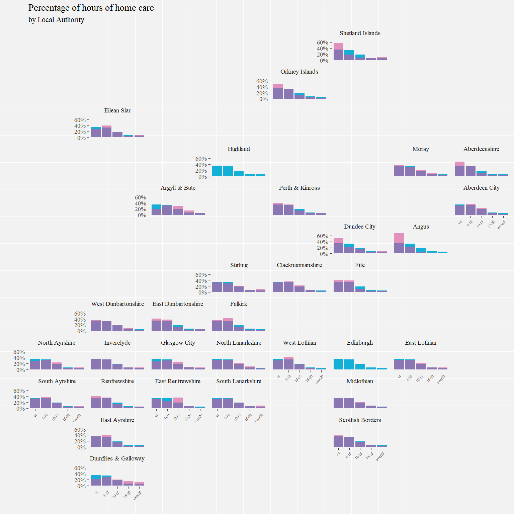

Facet plots
================

Introduction
============

Going to have a wee play trying to plot facetted (small multiple) data with main dataset in the background. Based on [this plot](link%20here!!!!)

Load data
---------

I'll use the 2012 social care survey data cleaned in `import_and_tidy.Rmd`

``` r
load("produced_data/created_objects/soc_care12.rds")
```

Load packages
-------------

``` r
library(tidyverse)
library(forcats)
library(ggthemes)
library(geofacet)
library(extrafont)
theme_set(theme_tufte(base_size = 18))
ubdc_palette <- c("#13AFD6", "#E6E600", "#F07329", "#35B14E", "#D7509A", "#2165AF",
                  "#BCD032","#866BAC", "#545A5D",  "#7A8082", "#E2D988", "#628DB7",
                  "#929B9A", "#93B8DA", "#31649B", "#FBF8D0", "#ACB2B4", "#D1DAE2")
```

Plot `age_grp`
==============

Glimpse
-------

Quick reminder of what the data looks like

``` r
glimpse(soc_care12)
```

    ## Observations: 141,144
    ## Variables: 21
    ## $ council        <fctr> Aberdeen City, Aberdeen City, Aberdeen City, A...
    ## $ client_id      <chr> "HRXYJ", "U61VU", "XP2LW", "3VXIH", "4CC3E", "L...
    ## $ age_grp        <fctr> 75-<85, 85+, 75-<85, 75-<85, 85+, 75-<85, 85+,...
    ## $ client_grp     <fctr> Infirmity due to Age, Infirmity due to Age, De...
    ## $ gender         <fctr> Female, Female, Female, Male, Male, Female, Fe...
    ## $ new_hrs        <dbl> 0, 2, 0, 3, 7, 18, 1, 0, 0, 3, 7, 0, 8, 0, 12, ...
    ## $ la_hrs         <fctr> Zero, Zero, Zero, Zero, Zero, 15-20, <1, Zero,...
    ## $ pri_hrs        <fctr> Zero, 2-4, Zero, 2-4, 6-8, Zero, Zero, Zero, Z...
    ## $ vol_hrs        <fctr> Zero, Zero, Zero, Zero, Zero, Zero, Zero, Zero...
    ## $ pc_hrs         <fctr> Zero, 2-4, Zero, 2-4, 6-8, 15-20, <1, Zero, Ze...
    ## $ total_hrs      <fctr> Zero, 2-4, Zero, 2-4, 6-8, 15-20, <1, Zero, Ze...
    ## $ hc_client      <fctr> No, Yes, No, Yes, Yes, Yes, Yes, No, No, Yes, ...
    ## $ comm_alarm     <fctr> No, Yes, No, No, No, No, No, No, Yes, Yes, No,...
    ## $ other_telecare <fctr> Yes, No, No, No, No, No, No, Yes, No, No, No, ...
    ## $ alarm_and_tele <fctr> No, No, No, No, No, No, No, No, No, No, No, No...
    ## $ living_arr     <fctr> NA, Other, NA, NA, Lives Alone, NA, NA, Other,...
    ## $ multi_staff    <fctr> Single Staff, Single Staff, Single Staff, Sing...
    ## $ housing_type   <fctr> Mainstream, Mainstream, Mainstream, Mainstream...
    ## $ laundry        <fctr> No, No, No, No, No, No, No, No, No, No, No, No...
    ## $ shopping       <fctr> No, No, No, No, No, No, No, No, No, No, No, No...
    ## $ housing_supp   <fctr> No, No, No, No, No, No, No, No, No, No, No, No...

Create data frame without grouping variable
-------------------------------------------

To start with I am going to try and plot the distribution of `age_grp` using `gender` as a facet.

To do this I will need a dataframe *without* the `gender` variable

``` r
nogen <- soc_care12 %>% select (-gender)
```

...and now plot

plot
----

``` r
ggplot(soc_care12, aes(age_grp)) + 
  geom_bar(data = nogen, fill = ubdc_palette[18]) +
  geom_bar() +
  facet_wrap(~ gender)
```


``` r
rm(nogen)
```

Will try something a bit more adventurous now.

Plot `home_care_hrs`
====================

In `home_care_plot.md` I compared the number of home care hours across Local Authorities. Will try and see if the background plot makes this comparison easier.

Create dataframe
----------------

I'll need to recreate the summary data

1st of all collapse the total\_hrs variable into smaller factor levels.

Currently &lt;1, 1-2, 2-4, 4-6, 6-8, 8-10, 10-15, 15-20, 20-30, 30-40, and over 50.

I'll collapse these levels to &lt;4, 4-10, 10-15, and over 20

``` r
soc_care12$total_hrs <- 
  fct_collapse(soc_care12$total_hrs, 
               `<4` = c("<1", "1-2", "2-4"),
               `4-10` = c("4-6", "6-8", "8-10"), #10-15 stays as is
               over20 = c("20-30", "30-40", "40-50", "over50"))
```

Now summarise the data

``` r
home_care_hrs_council <-
  soc_care12 %>%
  filter(hc_client == "Yes") %>%      #keep only home care clients
  filter(age_grp != "18-<65") %>%     #keep only those over 65
  filter(council != "Highland") %>%   #remove highland due to missing data
  group_by(council, total_hrs) %>%
  summarize(N = n()) %>%
  mutate(freq = N / sum(N),
         pct = round((freq*100), 1)) 

home_care_hrs_total <-
  soc_care12 %>% 
  filter(hc_client == "Yes") %>%      #keep only home care clients
  filter(age_grp != "18-<65") %>%     #keep only those over 65
  filter(council != "Highland") %>%   #remove highland due to missing data
  group_by(total_hrs) %>% 
  summarise(N = n()) %>% 
  mutate(freq = N / sum(N),
         pct = round((freq * 100), 2))

home_care_hrs_council
```

    ## # A tibble: 155 x 5
    ## # Groups:   council [31]
    ##          council total_hrs     N       freq   pct
    ##           <fctr>    <fctr> <int>      <dbl> <dbl>
    ##  1 Aberdeen City        <4   552 0.30941704  30.9
    ##  2 Aberdeen City      4-10   658 0.36883408  36.9
    ##  3 Aberdeen City     10-15   421 0.23598655  23.6
    ##  4 Aberdeen City     15-20   120 0.06726457   6.7
    ##  5 Aberdeen City    over20    33 0.01849776   1.8
    ##  6 Aberdeenshire        <4   879 0.48085339  48.1
    ##  7 Aberdeenshire      4-10   614 0.33588621  33.6
    ##  8 Aberdeenshire     10-15   209 0.11433260  11.4
    ##  9 Aberdeenshire     15-20    56 0.03063457   3.1
    ## 10 Aberdeenshire    over20    70 0.03829322   3.8
    ## # ... with 145 more rows

``` r
home_care_hrs_total
```

    ## # A tibble: 5 x 4
    ##   total_hrs     N       freq   pct
    ##      <fctr> <int>      <dbl> <dbl>
    ## 1        <4 17265 0.34922529 34.92
    ## 2      4-10 16573 0.33522796 33.52
    ## 3     10-15  9217 0.18643554 18.64
    ## 4     15-20  3602 0.07285893  7.29
    ## 5    over20  2781 0.05625228  5.63

'''and plot

``` r
ggplot(home_care_hrs_council, aes(total_hrs, freq)) +
  geom_bar(stat = "identity", data = home_care_hrs_total, fill = ubdc_palette[1]) +
  geom_bar(stat = "identity", fill = ubdc_palette[5], alpha = 0.6) +
  facet_geo(~ council, grid = "scotland_local_authority_grid1") +
  scale_y_continuous(labels = scales::percent) +
  theme(axis.text.x = element_text(angle = 45, hjust = 1, vjust = 1, size = 8)) +
  labs(
    title = "Percentage of hours of home care",
    subtitle = "by Local Authority",
    x = "",
    y = "")
```

    ## Some values in the specified facet_geo column 'council' do not
    ##   match the 'name' column of the specified grid and will be
    ##   removed: Edinburgh, City of


