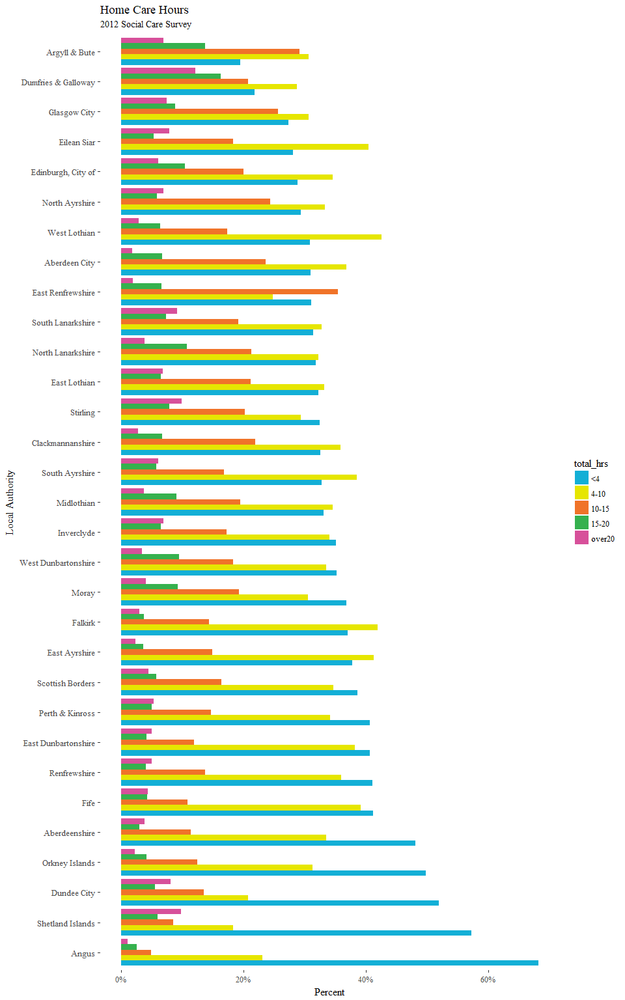
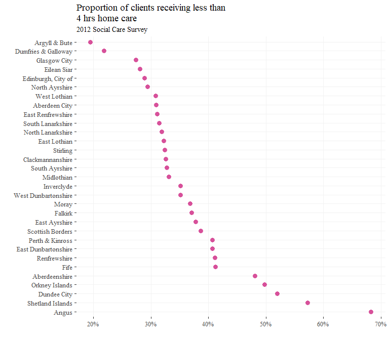
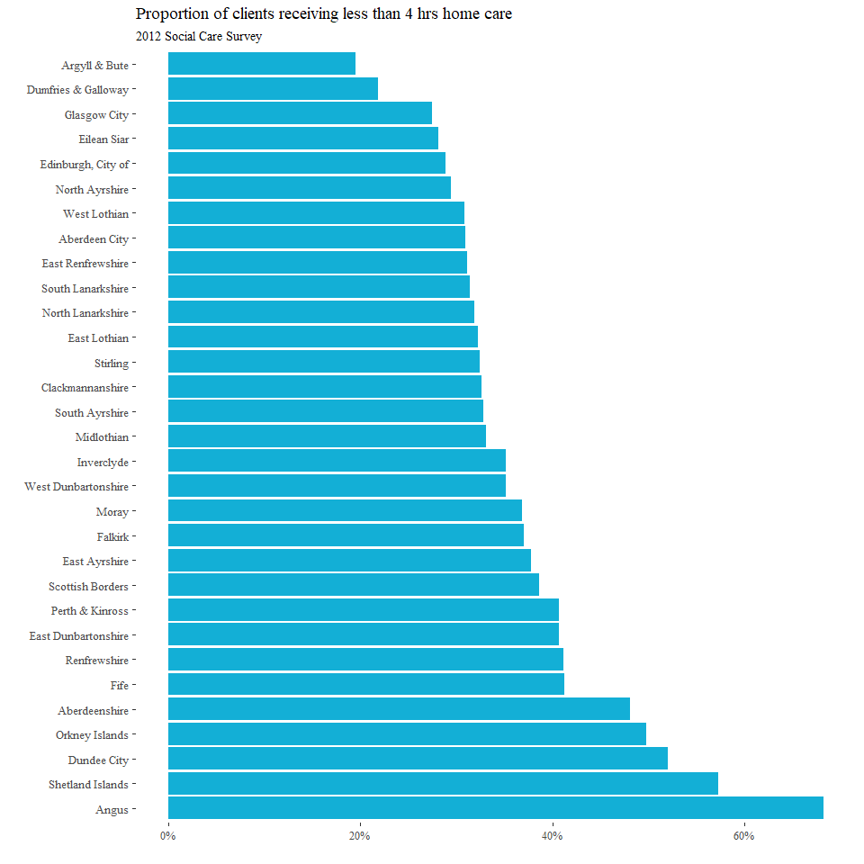
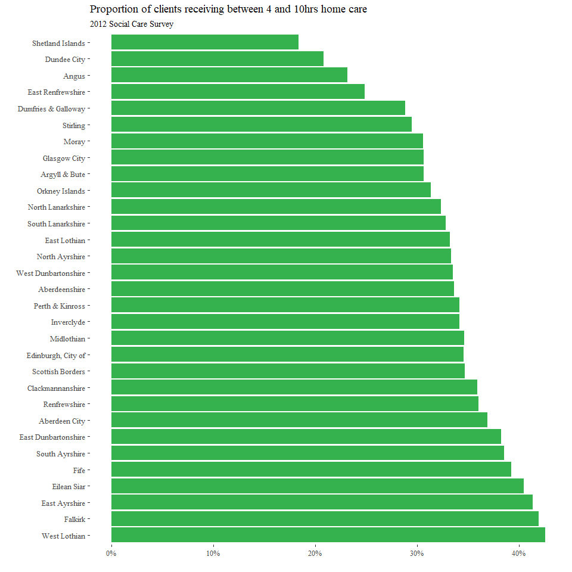
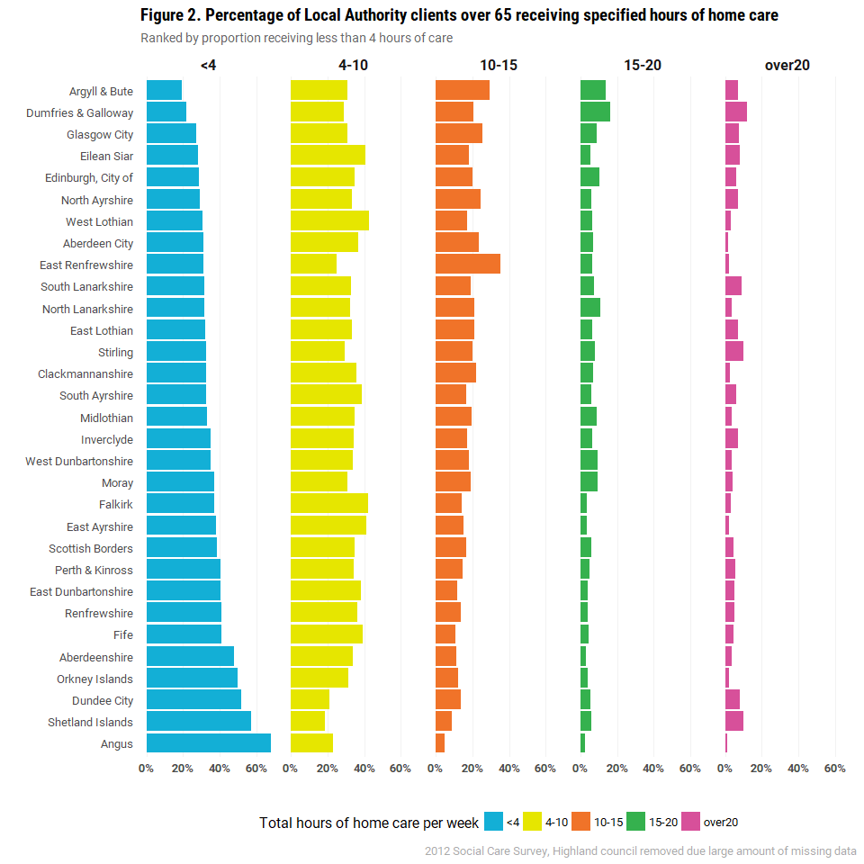
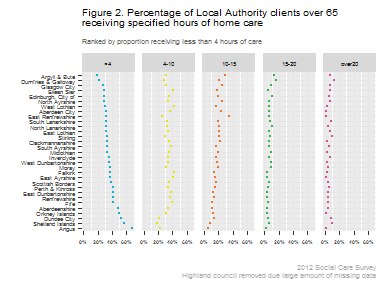

Home care hours
================

Intro
=====

Quick plot of home care hours for 2012

Load data
---------

Load 2011 data - object `soc_care11` was created in "reports/import\_and\_tidy.html"

``` r
load("produced_data/created_objects/soc_care12.rds")
```

Load packages
-------------

``` r
library(dplyr)
library(forcats)
library(ggplot2)
library(ggthemes)
library(extrafont)
theme_set(theme_tufte(base_size = 12))
ubdc_palette <- c("#13AFD6", "#E6E600", "#F07329", "#35B14E", "#D7509A", "#2165AF",
                  "#BCD032","#866BAC", "#545A5D",  "#7A8082", "#E2D988", "#628DB7",
                  "#929B9A", "#93B8DA", "#31649B", "#FBF8D0", "#ACB2B4", "#D1DAE2")
```

Plot
====

1st of all collapse the total\_hrs variable into smaller factor levels.

Currently &lt;1, 1-2, 2-4, 4-6, 6-8, 8-10, 10-15, 15-20, 20-30, 30-40, and over 50.

I'll collapse these levels to &lt;4, 4-10, 10-15, and over 20

``` r
soc_care12$total_hrs <- 
  fct_collapse(soc_care12$total_hrs, 
               `<4` = c("<1", "1-2", "2-4"),
               `4-10` = c("4-6", "6-8", "8-10"), #10-15 stays as is
               over20 = c("20-30", "30-40", "40-50", "over50"))
```

Now summarise the data

``` r
home_care_hrs <-
  soc_care12 %>%
  filter(hc_client == "Yes") %>%      #keep only home care clients
  filter(age_grp != "18-<65") %>%     #keep only those over 65
  filter(council != "Highland") %>%   #remove highland due to missing data
  group_by(council, total_hrs) %>%
  summarize(N = n()) %>%
  mutate(freq = N / sum(N),
         pct = round((freq*100), 1)) 

home_care_hrs
```

    ## # A tibble: 155 x 5
    ## # Groups:   council [31]
    ##          council total_hrs     N       freq   pct
    ##           <fctr>    <fctr> <int>      <dbl> <dbl>
    ##  1 Aberdeen City        <4   552 0.30941704  30.9
    ##  2 Aberdeen City      4-10   658 0.36883408  36.9
    ##  3 Aberdeen City     10-15   421 0.23598655  23.6
    ##  4 Aberdeen City     15-20   120 0.06726457   6.7
    ##  5 Aberdeen City    over20    33 0.01849776   1.8
    ##  6 Aberdeenshire        <4   879 0.48085339  48.1
    ##  7 Aberdeenshire      4-10   614 0.33588621  33.6
    ##  8 Aberdeenshire     10-15   209 0.11433260  11.4
    ##  9 Aberdeenshire     15-20    56 0.03063457   3.1
    ## 10 Aberdeenshire    over20    70 0.03829322   3.8
    ## # ... with 145 more rows

Now plot, to help ordering the bars I'm going to create a vector with the Local Authorities ordered by those with highest ratios of clients receiving &lt;4 hrs of home care. This vector can then be dropped into the ggplot to arrange the data as needed.

``` r
ordered <-                   #Create a vector with LAs ordered by <4hrs 
  home_care_hrs %>%
  filter(total_hrs == "<4") %>%
  arrange(-pct)

ordered_LAs <- ordered$council
```

Finally, time to plot

``` r
hmcare_plot <- 
  ggplot(home_care_hrs, 
            aes(
              x = reorder(council, pct), 
              y = freq,   #I'll use scales::percent below
              fill = total_hrs)) + 
  geom_bar(position = "dodge", stat = "identity") +
  labs(x = "Local Authority",
       y = "Percent", 
       fill = "total_hrs",
       title = "Home Care Hours",
       subtitle = "2012 Social Care Survey") +
  scale_y_continuous(labels = scales::percent) + #Using freq instead of percent variable
  scale_x_discrete(limits = ordered_LAs) +   #using above vector
  theme(legend.position = "right") +
  scale_fill_manual(values = ubdc_palette) +
  coord_flip()

hmcare_plot
```



Still a bit noisy, I'll try plotting &lt;4 hrs only

``` r
home_care_hrs %>% 
  filter(total_hrs == "<4") %>% 
  ggplot(aes(reorder(council, -freq), freq)) +
  geom_point(colour = ubdc_palette[5], size = 3) +
  coord_flip() +
  scale_y_continuous(labels = scales::percent) +
  theme(panel.grid.major = element_line(colour = "#f2f2f2")) +
  labs(x = "",
       y = "", 
       title = "Proportion of clients receiving less than \n4 hrs home care",
       subtitle = "2012 Social Care Survey") 
```



``` r
less_than_four_plot <- 
  home_care_hrs %>%
  filter(total_hrs == "<4") %>%
  ggplot(.,
         aes(
              x = reorder(council, -pct), 
              y = freq  #I'll use scales::percent below
              )) +   
  geom_col(fill = ubdc_palette[1]) +
  labs(x = "",
       y = "", 
       title = "Proportion of clients receiving less than 4 hrs home care",
       subtitle = "2012 Social Care Survey") +
  scale_y_continuous(labels = scales::percent) + #Using freq instead of percent variable
  theme(legend.position = "none") +
  coord_flip()

less_than_four_plot
```



``` r
four_to_ten_plot <- 
  home_care_hrs %>%
  filter(total_hrs == "4-10") %>%
  ggplot(.,
         aes(
              x = reorder(council, -pct), 
              y = freq  #I'll use scales::percent below
              )) +   
  geom_col(fill = ubdc_palette[4]) +
  labs(x = "",
       y = "", 
       title = "Proportion of clients receiving between 4 and 10hrs home care",
       subtitle = "2012 Social Care Survey") +
  scale_y_continuous(labels = scales::percent) + #Using freq instead of percent variable
  theme(legend.position = "none") +
  coord_flip()

four_to_ten_plot
```



Actually, a facet plot will be much better...

``` r
home_care_facet <- 
  ggplot(home_care_hrs, 
         aes(
           x = council,
           y = freq,   #I'll use scales::percent below
           fill = total_hrs)) + 
  geom_col() +
  facet_wrap(~total_hrs, ncol = 5) +
  scale_x_discrete(limits = ordered_LAs) +
  scale_y_continuous(labels = scales::percent) + #Using freq instead of percent variable
  labs(x = "",
       y = "", 
       fill = "Total hours of home care per week",
       title = "Figure 2. Percentage of Local Authority clients over 65 receiving specified hours of home care", #Figure 2 for UBDC blog only!
       subtitle = "Ranked by proportion receiving less than 4 hours of care",
       caption = "2012 Social Care Survey, Highland council removed due large amount of missing data") +
  theme_minimal(base_size = 12, base_family = "Roboto") +
  theme(legend.position = "bottom",
        plot.subtitle = element_text(color="#666666"),
        plot.title = element_text(family="Roboto Condensed", face = "bold"),
        plot.caption = element_text(color="#AAAAAA", size=10),
        axis.text.y = element_text(size = 10),
        axis.text.x = element_text(size = 10, face = "bold"),
        strip.text.x = element_text(size = 12, face = "bold"),
        panel.grid.major.x = element_line(colour = "#f2f2f2")) +
  scale_fill_manual(values = ubdc_palette) +
  coord_flip()

home_care_facet
```



Save for UBDC blog

``` r
ggplot2::ggsave(home_care_facet, filename = "plots/homecare_facet.png")
```

Try a clevland dotplot

``` r
home_care_facet_clevland <- 
  ggplot(home_care_hrs, 
         aes(
           x = council,
           y = freq,   #I'll use scales::percent below
           color = total_hrs)) + 
  geom_point(size = 2) +
  facet_wrap(~total_hrs, ncol = 5) +
  scale_x_discrete(limits = ordered_LAs) +
  scale_y_continuous(labels = scales::percent) + #Using freq instead of percent variable
  labs(x = "",
       y = "", 
       fill = "Total hours of home care per week",
       title = "Figure 2. Percentage of Local Authority clients over 65\nreceiving specified hours of home care", #Figure 2 for UBDC blog only!
       subtitle = "Ranked by proportion receiving less than 4 hours of care",
       caption = "2012 Social Care Survey\nHighland council removed due large amount of missing data")  +
  coord_flip() +
  theme(legend.position = "none",
        plot.subtitle = element_text(color="#666666", size = 10),
        plot.caption = element_text(color="#AAAAAA", size=10),
        axis.text.x = element_text(size = 7, face = "bold"),
        panel.grid.major = element_line(color = "#f2f2f2")) +
  scale_color_manual(values = ubdc_palette)

home_care_facet_clevland
```



``` r
ggsave("plots/homecare_facet_clevland.png", home_care_facet_clevland, dpi = 1000)
```

    ## Saving 7 x 5 in image
