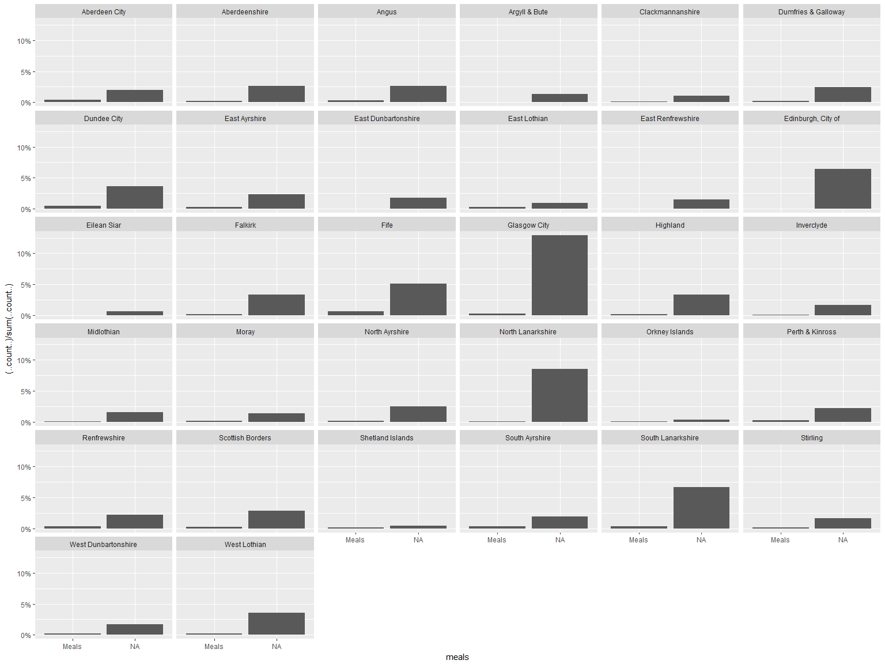
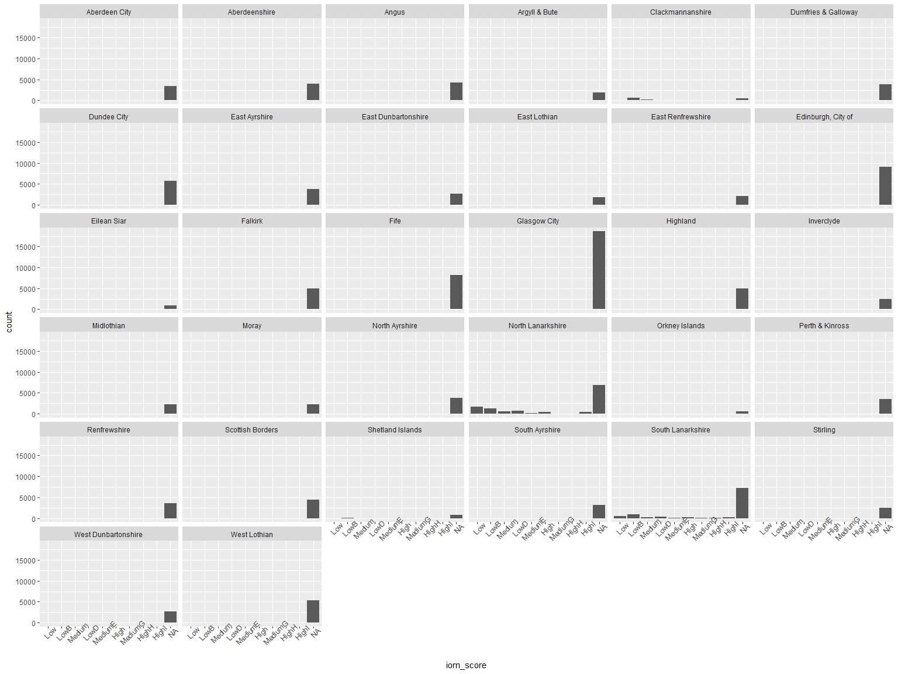

Social Care Survey Open Data
================

Introduction
============

The social care survey is collected anually by the Scottish Government from all of the 32 Local Authorities in Scotland. Full history of data collection and metadata for the public release files in available [here](http://www.gov.scot/Resource/0040/00409164.pdf).

Public release data is for 3 years - 2010, 2011, and 2012 and is avaiable [here](http://www.gov.scot/Topics/Statistics/Browse/Health/Data/HomeCare/HSC-Datasets-HCPRF).

Aims
----

-   Import data into R
-   Tidy and coerce variables
-   Save data as .rds objects

Packages
--------

Load required packages

``` r
library(tidyverse)
library(forcats)
```

Import Data
===========

I've downloaded these files into the "raw\_data" project folder and I'll imort them into R now,

``` r
soc_care10 <- read_csv("raw_data/public_release_sc_2010.csv")
soc_care11 <- read_csv("raw_data/public_release_sc_2011.csv")
soc_care12 <- read_csv("raw_data/public_release_sc_2012.csv")
```

Tidy data
=========

Let's start by looking at each set of data

Glimpse
-------

``` r
soc_care10
```

    ## # A tibble: 76,202 x 19
    ##    LAcode clientID AgeGRP ClientGRP GenderISO meals bandHRSLA bandHRSpri
    ##     <int>    <chr>  <int>     <chr>     <chr> <int>     <int>      <int>
    ##  1    100    ZZXJX      5         .         .     1         0          0
    ##  2    100    VLKT8      4         4         1     1         0          3
    ##  3    100    418H1      3         4         1     0         0          5
    ##  4    100    7SF1N      4         4         1     0         0          5
    ##  5    100    TKCFN      3         4         1     0         0          8
    ##  6    100    5EFK3      3         4         2     1         0          8
    ##  7    100    DAK8A      3         4         1     0         0          3
    ##  8    100    V7E3J      3         4         1     0         0          4
    ##  9    100    17D8B      3         4         1     0         5          0
    ## 10    100    Z3BO7      5         .         .     1         0          0
    ## # ... with 76,192 more rows, and 11 more variables: bandHRSvol <int>,
    ## #   bandHRSPC <int>, bandHRSTT <int>, HCclient <int>, LivingArr <int>,
    ## #   Staff <int>, HousingType_OV <int>, Laundry_OV <int>,
    ## #   Shopping_OV <int>, HousingSupport_OV <int>, IoRN_OV <chr>

``` r
soc_care11
```

    ## # A tibble: 142,466 x 22
    ##    LAcode clientID AgeGRP ClientGRP GenderISO meals bandHRSLA bandHRSpri
    ##     <int>    <chr>  <int>     <int>     <int> <int>     <int>      <int>
    ##  1    100    17L9J      3         4         2    NA         0          0
    ##  2    100    3Z8FK      4         4         2    NA         0          0
    ##  3    100    BKKAY      3         1         2    NA         0          0
    ##  4    100    8BT1I      3         1         2     1         0          0
    ##  5    100    XMH3X      3         4         1    NA         0          2
    ##  6    100    YQ6HE      4         4         1    NA         0          5
    ##  7    100    3AAZR      4         4         2    NA         0          4
    ##  8    100    TTYAU      3         4         1    NA         0          8
    ##  9    100    1XJ19      3         4         2    NA         8          0
    ## 10    100    6C7EW      4         4         2    NA         1          0
    ## # ... with 142,456 more rows, and 14 more variables: bandHRSvol <int>,
    ## #   bandHRSPC <int>, bandHRSTT <int>, HCclient <int>,
    ## #   communityalarmonly <int>, telecareonly <int>,
    ## #   communityandtelecare <int>, LivingArr <int>, Staff <int>,
    ## #   HousingType_OV <int>, Laundry_OV <int>, Shopping_OV <int>,
    ## #   HousingSupport_OV <int>, IoRN_OV <chr>

``` r
soc_care12
```

    ## # A tibble: 141,144 x 26
    ##    LAcode clientID AgeGRP ClientGRP GenderISO meals error1 error newhours
    ##     <int>    <chr>  <int>     <int>     <int> <int>  <chr> <chr>    <int>
    ##  1    100    HRXYJ      3         4         2    NA   <NA>  <NA>       NA
    ##  2    100    U61VU      4         4         2    NA   <NA>  <NA>        2
    ##  3    100    XP2LW      3         1         2     1   <NA>  <NA>       NA
    ##  4    100    3VXIH      3         4         1    NA   <NA>  <NA>        3
    ##  5    100    4CC3E      4         4         1    NA   <NA>  <NA>        7
    ##  6    100    L311I      3         4         2    NA   <NA>  <NA>       18
    ##  7    100    OUG1F      4         4         2    NA   <NA>  <NA>        1
    ##  8    100    BU0AY      2         1         2    NA   <NA>  <NA>       NA
    ##  9    100    C51LO      3         4         1    NA   <NA>  <NA>       NA
    ## 10    100    KYLU9      4         4         2    NA   <NA>  <NA>        3
    ## # ... with 141,134 more rows, and 17 more variables: HCFlag <int>,
    ## #   bandHRSLA <int>, bandHRSpri <int>, bandHRSvol <int>, bandHRSPC <int>,
    ## #   bandHRSTT <int>, HCclient <int>, communityalarmonly <int>,
    ## #   telecareonly <int>, communityandtelecare <int>, LivingArr <int>,
    ## #   Staff <int>, HousingType_OV <int>, Laundry_OV <int>,
    ## #   Shopping_OV <int>, HousingSupport_OV <int>, IoRN_OV <chr>

We can see in 2010 there are 76202 observations of 19 variables. 2011 has 142466 observations of 22 variables and 2010 has 141144 observations of 26 variables.

The reason for the discrepancies in observations is that 2011 and 2012 data contains information on individuals who received not just home care, but also telecare which almost doubles the number of people included.

3 telecare variables are added in 2011. In 2012 these 3 variables are present plus an extra variable `newhours`. There are also 3 unneeded variables in 2012; `error`, `error1`, and `HCFlag`. The first two are self-explanatory. The third is a duplicate of the `HCclient` variable. I'll drop these now before we start to tidy.

``` r
soc_care12 %>% select(-error, -error1, -HCFlag) -> soc_care12
```

With the exception of`clientID` in each year, every variable needs coerced. The majority of these variables should be factors. I could re-import the data and try `stringsasFactor == TRUE`. I'm not so sure this would work and, anyhow, I want to explicitly name the labels for the factors.

1st of all though, we'll sort out the variable names.

New names
=========

``` r
#different number of coulmns in each year so requires seperate commands

names(soc_care10) <- c("council", "client_id", "age_grp", "client_grp", "gender", "meals",
                       "la_hrs", "pri_hrs", "vol_hrs", "pc_hrs", "total_hrs", "hc_client",
                       "living_arr", "multi_staff", "housing_type", "laundry", "shopping",
                       "housing_supp", "iorn_score")

names(soc_care11) <- c("council", "client_id", "age_grp", "client_grp", "gender", "meals",
                       "la_hrs", "pri_hrs", "vol_hrs", "pc_hrs", "total_hrs", "hc_client",
                       "comm_alarm", "other_telecare", "alarm_and_tele", "living_arr", 
                       "multi_staff", "housing_type", "laundry", "shopping",
                       "housing_supp", "iorn_score")

names(soc_care12) <- c("council", "client_id", "age_grp", "client_grp", "gender", "meals",
                       "new_hrs", "la_hrs", "pri_hrs", "vol_hrs", "pc_hrs", "total_hrs",
                       "hc_client", "comm_alarm", "other_telecare", "alarm_and_tele", 
                       "living_arr", "multi_staff", "housing_type", "laundry", "shopping",
                       "housing_supp", "iorn_score")
```

Coerce variables.
=================

I'll coerce each in order here. I'm being explicit so I can set the labels for each factor level. All labels and levels identified from the [metadata file](http://www.gov.scot/Resource/0040/00409164.pdf).

Local Authority Code
--------------------

``` r
la_levels <- c("100", "110", "120", "130", "150", "170","180","190","200", "210", "220",
              "230", "235", "240", "250", "260","270", "280", "290", "300", "310", "320",
              "330", "340","350", "355", "360", "370", "380", "390", "395", "400")
la_labels <- c("Aberdeen City", "Aberdeenshire", "Angus", "Argyll & Bute", "Clackmannanshire",
              "Dumfries & Galloway", "Dundee City", "East Ayrshire", 
              "East Dunbartonshire","East Lothian", "East Renfrewshire",
              "Edinburgh, City of", "Eilean Siar", "Falkirk", "Fife", "Glasgow City",
              "Highland","Inverclyde", "Midlothian", "Moray", "North Ayrshire",
              "North Lanarkshire", "Orkney Islands","Perth & Kinross", "Renfrewshire",
              "Scottish Borders", "Shetland Islands","South Ayrshire", "South Lanarkshire",
              "Stirling","West Dunbartonshire","West Lothian")

soc_care10$council <- factor(soc_care10$council,
                            levels = la_levels,
                            labels = la_labels)

soc_care11$council <- factor(soc_care11$council,
                            levels = la_levels,
                            labels = la_labels)

soc_care12$council <- factor(soc_care12$council,
                            levels = la_levels,
                            labels = la_labels)

fct_count(soc_care10$council)  #Count factor levels as diagnostic check
```

    ## # A tibble: 32 x 2
    ##                      f     n
    ##                 <fctr> <int>
    ##  1       Aberdeen City  2087
    ##  2       Aberdeenshire  4284
    ##  3               Angus  2843
    ##  4       Argyll & Bute   920
    ##  5    Clackmannanshire  2395
    ##  6 Dumfries & Galloway  2513
    ##  7         Dundee City  2479
    ##  8       East Ayrshire  1904
    ##  9 East Dunbartonshire  1452
    ## 10        East Lothian  1790
    ## # ... with 22 more rows

``` r
fct_count(soc_care11$council)
```

    ## # A tibble: 32 x 2
    ##                      f     n
    ##                 <fctr> <int>
    ##  1       Aberdeen City  3337
    ##  2       Aberdeenshire  4157
    ##  3               Angus  4571
    ##  4       Argyll & Bute  1904
    ##  5    Clackmannanshire  1541
    ##  6 Dumfries & Galloway  3733
    ##  7         Dundee City  5759
    ##  8       East Ayrshire  4099
    ##  9 East Dunbartonshire  2580
    ## 10        East Lothian  2752
    ## # ... with 22 more rows

``` r
fct_count(soc_care12$council)
```

    ## # A tibble: 32 x 2
    ##                      f     n
    ##                 <fctr> <int>
    ##  1       Aberdeen City  3352
    ##  2       Aberdeenshire  3984
    ##  3               Angus  4290
    ##  4       Argyll & Bute  1942
    ##  5    Clackmannanshire  1612
    ##  6 Dumfries & Galloway  3785
    ##  7         Dundee City  5791
    ##  8       East Ayrshire  3736
    ##  9 East Dunbartonshire  2609
    ## 10        East Lothian  1785
    ## # ... with 22 more rows

``` r
rm(list = c("la_labels", "la_levels"))
```

Age Group
---------

`age_grp` has been imported as an integer - factorise.

``` r
age_grp_levels = c("1", "2", "3", "4", "5")
age_grp_labels <- c("18-<65", "65-<75", "75-<85", "85+", "Unknown")

#2010

soc_care10$age_grp <- factor(soc_care10$age_grp,
                            levels = age_grp_levels,
                            labels = age_grp_labels)
soc_care10$age_grp[soc_care10$age_grp == "Unknown"] <- NA #Convert Missing data to NA
soc_care10$age_grp <- fct_drop(soc_care10$age_grp, only = "Unknown") #Drop unknown level


#2011

soc_care11$age_grp <- factor(soc_care11$age_grp,
                            levels = age_grp_levels,
                            labels = age_grp_labels)
soc_care11$age_grp[soc_care11$age_grp == "Unknown"] <- NA #Convert missing data to NA
soc_care11$age_grp <- fct_drop(soc_care11$age_grp, only = "Unknown")

#2012

soc_care12$age_grp <- factor(soc_care12$age_grp,
                            levels = age_grp_levels,
                            labels = age_grp_labels)
soc_care12$age_grp[soc_care12$age_grp == "Unknown"] <- NA #Convert Missing data to NA
soc_care12$age_grp <- fct_drop(soc_care12$age_grp, only = "Unknown")

fct_count(soc_care10$age_grp) #Count factor levels as diagnostic check
```

    ## # A tibble: 5 x 2
    ##        f     n
    ##   <fctr> <int>
    ## 1 18-<65 12297
    ## 2 65-<75 10219
    ## 3 75-<85 23248
    ## 4    85+ 22499
    ## 5   <NA>  7939

``` r
fct_count(soc_care11$age_grp)
```

    ## # A tibble: 5 x 2
    ##        f     n
    ##   <fctr> <int>
    ## 1 18-<65 23085
    ## 2 65-<75 22897
    ## 3 75-<85 49857
    ## 4    85+ 43228
    ## 5   <NA>  3399

``` r
fct_count(soc_care12$age_grp)
```

    ## # A tibble: 5 x 2
    ##        f     n
    ##   <fctr> <int>
    ## 1 18-<65 23755
    ## 2 65-<75 22861
    ## 3 75-<85 49495
    ## 4    85+ 43689
    ## 5   <NA>  1344

``` r
rm(list = c("age_grp_labels", "age_grp_levels"))
```

Client Group
------------

`client_grp` came in as an integer for 2010 but as a character for 2011 and 2012. I will recode them all to factors and add the labels.

``` r
client_grp_levels <- c("1", "2", "3", "4", "5", "99", ".")
client_grp_labels <- c("Dementia & Mental Health", "Learning Disability", 
                     "Physical Disability", "Infirmity due to Age","Other",
                     "Not Known", "Blank")

#2010

soc_care10$client_grp <- factor(soc_care10$client_grp,
                               levels = client_grp_levels,
                               labels = client_grp_labels)

soc_care10$client_grp <- fct_collapse(soc_care10$client_grp,
                                      missing = c("Not Known", "Blank"))

soc_care10$client_grp[soc_care10$client_grp == "missing"] <- NA #Covert missing data to NA
soc_care10$client_grp <- fct_drop(soc_care10$client_grp, only = "missing") #drop missing level


#2011

soc_care11$client_grp <- factor(soc_care11$client_grp,
                               levels = client_grp_levels,
                               labels = client_grp_labels)

soc_care11$client_grp <- fct_collapse(soc_care11$client_grp,
                                      missing = c("Not Known", "Blank"))

soc_care11$client_grp[soc_care11$client_grp == "missing"] <- NA #Covert missing data to NA
soc_care11$client_grp <- fct_drop(soc_care11$client_grp, only = "missing") #drop missing level


#2012
soc_care12$client_grp <- factor(soc_care12$client_grp,
                               levels = client_grp_levels,
                               labels = client_grp_labels)
soc_care12$client_grp <- fct_collapse(soc_care12$client_grp,
                                      missing = c("Not Known", "Blank"))

soc_care12$client_grp[soc_care12$client_grp == "missing"] <- NA #Covert missing data to NA
soc_care12$client_grp <- fct_drop(soc_care12$client_grp, only = "missing") #drop missing level

fct_count(soc_care10$client_grp) #Count for diagnostic purposes
```

    ## # A tibble: 6 x 2
    ##                          f     n
    ##                     <fctr> <int>
    ## 1 Dementia & Mental Health  6720
    ## 2      Learning Disability  4213
    ## 3      Physical Disability 17347
    ## 4     Infirmity due to Age 37100
    ## 5                    Other  2103
    ## 6                     <NA>  8719

``` r
fct_count(soc_care11$client_grp)
```

    ## # A tibble: 6 x 2
    ##                          f     n
    ##                     <fctr> <int>
    ## 1 Dementia & Mental Health  8058
    ## 2      Learning Disability  5425
    ## 3      Physical Disability 33471
    ## 4     Infirmity due to Age 64587
    ## 5                    Other  5020
    ## 6                     <NA> 25905

``` r
fct_count(soc_care12$client_grp)
```

    ## # A tibble: 6 x 2
    ##                          f     n
    ##                     <fctr> <int>
    ## 1 Dementia & Mental Health  8188
    ## 2      Learning Disability  5905
    ## 3      Physical Disability 35928
    ## 4     Infirmity due to Age 69342
    ## 5                    Other  4618
    ## 6                     <NA> 17163

``` r
rm(list = c("client_grp_labels", "client_grp_levels"))
```

Gender
------

`gender` again imported as an integer in 2010 but as a charcterin other 2 years. Again will recode all years to add labels.

``` r
#2010
soc_care10$gender <- factor(soc_care10$gender,
                               levels = c("1", "2", "."),
                               labels = c("Male", "Female", "Blank"))
soc_care10$gender[soc_care10$gender == "Blank"] <- NA #Convert missing to NA level
soc_care10$gender <- fct_drop(soc_care10$gender, only = "Blank") #and drop empty level

#2011
soc_care11$gender <- factor(soc_care11$gender,
                               levels = c("1", "2", "."),
                               labels = c("Male", "Female", "Blank"))
soc_care11$gender[soc_care11$gender == "Blank"] <- NA #Convert missing to NA level
soc_care11$gender <- fct_drop(soc_care11$gender, only = "Blank") #and drop empty level

#2012
soc_care12$gender <- factor(soc_care12$gender,
                               levels = c("1", "2", "."),
                               labels = c("Male", "Female", "Blank"))
soc_care12$gender[soc_care12$gender == "Blank"] <- NA #Convert missing to NA level
soc_care12$gender <- fct_drop(soc_care12$gender, only = "Blank") #and drop empty level

fct_count(soc_care10$gender)
```

    ## # A tibble: 3 x 2
    ##        f     n
    ##   <fctr> <int>
    ## 1   Male 22384
    ## 2 Female 45893
    ## 3   <NA>  7925

``` r
fct_count(soc_care11$gender)
```

    ## # A tibble: 3 x 2
    ##        f     n
    ##   <fctr> <int>
    ## 1   Male 46281
    ## 2 Female 93832
    ## 3   <NA>  2353

``` r
fct_count(soc_care12$gender)
```

    ## # A tibble: 3 x 2
    ##        f     n
    ##   <fctr> <int>
    ## 1   Male 46846
    ## 2 Female 94282
    ## 3   <NA>    16

Meals
-----

Factorise meals - dichotomous variable. **The 2011 and 2012 .csv files only seem to have values for meals meaning we have to presume empty values are "no meals", rather than missing data.** Not too sure about this but will investgate further in the analysis. For now the data stays as missing and will be computed as NA

``` r
soc_care10$meals <- factor(soc_care10$meals,
                           levels = c("0", "1"),
                           labels = c("No meals", "Meals")) 


soc_care11$meals <- factor(soc_care11$meals,
                           levels = c("0", "1"),
                           labels = c("No meals", "Meals"))


soc_care12$meals <- factor(soc_care12$meals,
                           levels = c("0", "1"),
                           labels = c("No meals", "Meals")) 

#Slightly different coding from metadata to make Graph labels more readable

fct_count(soc_care10$meals)
```

    ## # A tibble: 2 x 2
    ##          f     n
    ##     <fctr> <int>
    ## 1 No meals 66125
    ## 2    Meals 10077

``` r
fct_count(soc_care11$meals)
```

    ## # A tibble: 3 x 2
    ##          f      n
    ##     <fctr>  <int>
    ## 1 No meals      0
    ## 2    Meals  10089
    ## 3     <NA> 132377

``` r
fct_count(soc_care12$meals)
```

    ## # A tibble: 3 x 2
    ##          f      n
    ##     <fctr>  <int>
    ## 1 No meals      0
    ## 2    Meals   9621
    ## 3     <NA> 131523

The Scottish Government report of the Social Care Survey states that Local Authorities found it difficult to collect and return data on meals. We can see that when visualising returns by Local Authority - I'm using 2012 as an example here:-

``` r
library(ggplot2)
soc_care12 %>%
  ggplot(aes(x = meals)) +
  geom_bar(aes(y = (..count..)/sum(..count..))) +
  scale_y_continuous(labels = scales::percent) +
  facet_wrap(~ council)
```



Missing data does not seem to be at random here suggesting there is more of a structural issue with reporting of meals data.

I'll drop this variable from the datasets

``` r
soc_care10 %>% select(-meals) -> soc_care10

soc_care11 %>% select(-meals) -> soc_care11

soc_care12 %>% select(-meals) -> soc_care12
```

Home Care Hours
---------------

Need to factorise Home Care Hours also. This variable has been pre-banded but imported as an integer. Start with the Total Hours

``` r
hrs_levels <- c("0", "1", "2", "3", "4", "5", "6", "7", "8", "9", "10", "11", "12")
hrs_labels <- c("Zero", "<1", "1-2", "2-4", "4-6","6-8", "8-10", "10-15", "15-20",
                    "20-30","30-40", "40-50", "over50")

soc_care10$total_hrs <- factor(soc_care10$total_hrs,
                               levels = hrs_levels,
                               labels = hrs_labels)

soc_care11$total_hrs <- factor(soc_care11$total_hrs,
                               levels = hrs_levels,
                               labels = hrs_labels)

soc_care12$total_hrs <- factor(soc_care12$total_hrs,
                               levels = hrs_levels,
                               labels = hrs_labels)
fct_count(soc_care10$total_hrs)
```

    ## # A tibble: 13 x 2
    ##         f     n
    ##    <fctr> <int>
    ##  1   Zero 10687
    ##  2     <1  2740
    ##  3    1-2  8826
    ##  4    2-4 13289
    ##  5    4-6  7387
    ##  6    6-8  7867
    ##  7   8-10  4672
    ##  8  10-15 10402
    ##  9  15-20  4480
    ## 10  20-30  2583
    ## 11  30-40  1197
    ## 12  40-50   555
    ## 13 over50  1517

``` r
fct_count(soc_care11$total_hrs)
```

    ## # A tibble: 13 x 2
    ##         f     n
    ##    <fctr> <int>
    ##  1   Zero 79714
    ##  2     <1  2146
    ##  3    1-2  7466
    ##  4    2-4 12612
    ##  5    4-6  6982
    ##  6    6-8  8271
    ##  7   8-10  4635
    ##  8  10-15 10541
    ##  9  15-20  4270
    ## 10  20-30  2538
    ## 11  30-40  1237
    ## 12  40-50   468
    ## 13 over50  1586

``` r
fct_count(soc_care12$total_hrs)
```

    ## # A tibble: 13 x 2
    ##         f     n
    ##    <fctr> <int>
    ##  1   Zero 78917
    ##  2     <1  2034
    ##  3    1-2  6859
    ##  4    2-4 11899
    ##  5    4-6  7110
    ##  6    6-8  8273
    ##  7   8-10  4688
    ##  8  10-15 10956
    ##  9  15-20  4447
    ## 10  20-30  2450
    ## 11  30-40  1192
    ## 12  40-50   478
    ## 13 over50  1841

Now need to do all the other Home Care Hours variables.

``` r
#2010
soc_care10$la_hrs <- factor(soc_care10$la_hrs,
                               levels = hrs_levels,
                               labels = hrs_labels)

soc_care10$pri_hrs <- factor(soc_care10$pri_hrs,
                               levels = hrs_levels,
                               labels = hrs_labels)

soc_care10$vol_hrs <- factor(soc_care10$vol_hrs,
                               levels = hrs_levels,
                               labels = hrs_labels)

soc_care10$pc_hrs <- factor(soc_care10$pc_hrs,
                               levels = hrs_levels,
                               labels = hrs_labels)
#2011
soc_care11$la_hrs <- factor(soc_care11$la_hrs,
                               levels = hrs_levels,
                               labels = hrs_labels)

soc_care11$pri_hrs <- factor(soc_care11$pri_hrs,
                               levels = hrs_levels,
                               labels = hrs_labels)

soc_care11$vol_hrs <- factor(soc_care11$vol_hrs,
                               levels = hrs_levels,
                               labels = hrs_labels)

soc_care11$pc_hrs <- factor(soc_care11$pc_hrs,
                               levels = hrs_levels,
                               labels = hrs_labels)
#2012
soc_care12$la_hrs <- factor(soc_care12$la_hrs,
                               levels = hrs_levels,
                               labels = hrs_labels)

soc_care12$pri_hrs <- factor(soc_care12$pri_hrs,
                               levels = hrs_levels,
                               labels = hrs_labels)

soc_care12$vol_hrs <- factor(soc_care12$vol_hrs,
                               levels = hrs_levels,
                               labels = hrs_labels)

soc_care12$pc_hrs <- factor(soc_care12$pc_hrs,
                               levels = hrs_levels,
                               labels = hrs_labels)

fct_count(soc_care10$la_hrs)
```

    ## # A tibble: 13 x 2
    ##         f     n
    ##    <fctr> <int>
    ##  1   Zero 28319
    ##  2     <1  2514
    ##  3    1-2  8290
    ##  4    2-4 11357
    ##  5    4-6  5780
    ##  6    6-8  5521
    ##  7   8-10  3409
    ##  8  10-15  6510
    ##  9  15-20  2446
    ## 10  20-30  1066
    ## 11  30-40   467
    ## 12  40-50   179
    ## 13 over50   344

``` r
fct_count(soc_care11$la_hrs)
```

    ## # A tibble: 13 x 2
    ##         f     n
    ##    <fctr> <int>
    ##  1   Zero 99411
    ##  2     <1  2055
    ##  3    1-2  6653
    ##  4    2-4 10173
    ##  5    4-6  5061
    ##  6    6-8  5552
    ##  7   8-10  3060
    ##  8  10-15  6392
    ##  9  15-20  2226
    ## 10  20-30  1042
    ## 11  30-40   420
    ## 12  40-50   126
    ## 13 over50   295

``` r
fct_count(soc_care12$la_hrs)
```

    ## # A tibble: 13 x 2
    ##         f      n
    ##    <fctr>  <int>
    ##  1   Zero 101602
    ##  2     <1   1844
    ##  3    1-2   5739
    ##  4    2-4   9019
    ##  5    4-6   4666
    ##  6    6-8   5265
    ##  7   8-10   2889
    ##  8  10-15   6104
    ##  9  15-20   2049
    ## 10  20-30    962
    ## 11  30-40    401
    ## 12  40-50    145
    ## 13 over50    459

``` r
fct_count(soc_care10$pri_hrs)
```

    ## # A tibble: 13 x 2
    ##         f     n
    ##    <fctr> <int>
    ##  1   Zero 57566
    ##  2     <1   197
    ##  3    1-2  1555
    ##  4    2-4  3636
    ##  5    4-6  1962
    ##  6    6-8  2804
    ##  7   8-10  1182
    ##  8  10-15  3352
    ##  9  15-20  1545
    ## 10  20-30  1103
    ## 11  30-40   490
    ## 12  40-50   234
    ## 13 over50   576

``` r
fct_count(soc_care11$pri_hrs)
```

    ## # A tibble: 13 x 2
    ##         f      n
    ##    <fctr>  <int>
    ##  1   Zero 121644
    ##  2     <1    448
    ##  3    1-2   1991
    ##  4    2-4   4066
    ##  5    4-6   2315
    ##  6    6-8   3023
    ##  7   8-10   1418
    ##  8  10-15   3650
    ##  9  15-20   1603
    ## 10  20-30   1027
    ## 11  30-40    492
    ## 12  40-50    188
    ## 13 over50    601

``` r
fct_count(soc_care12$pri_hrs)
```

    ## # A tibble: 13 x 2
    ##         f      n
    ##    <fctr>  <int>
    ##  1   Zero 117804
    ##  2     <1    503
    ##  3    1-2   2149
    ##  4    2-4   4384
    ##  5    4-6   2618
    ##  6    6-8   3312
    ##  7   8-10   1673
    ##  8  10-15   4238
    ##  9  15-20   1879
    ## 10  20-30   1045
    ## 11  30-40    544
    ## 12  40-50    204
    ## 13 over50    791

``` r
fct_count(soc_care10$vol_hrs)
```

    ## # A tibble: 14 x 2
    ##         f     n
    ##    <fctr> <int>
    ##  1   Zero 72201
    ##  2     <1   316
    ##  3    1-2   224
    ##  4    2-4   742
    ##  5    4-6   479
    ##  6    6-8   335
    ##  7   8-10    95
    ##  8  10-15   346
    ##  9  15-20   180
    ## 10  20-30   267
    ## 11  30-40   175
    ## 12  40-50   104
    ## 13 over50   547
    ## 14   <NA>   191

``` r
fct_count(soc_care11$vol_hrs)
```

    ## # A tibble: 14 x 2
    ##         f      n
    ##    <fctr>  <int>
    ##  1   Zero 138635
    ##  2     <1     16
    ##  3    1-2    180
    ##  4    2-4    718
    ##  5    4-6    435
    ##  6    6-8    314
    ##  7   8-10    113
    ##  8  10-15    356
    ##  9  15-20    188
    ## 10  20-30    303
    ## 11  30-40    226
    ## 12  40-50    130
    ## 13 over50    663
    ## 14   <NA>    189

``` r
fct_count(soc_care12$vol_hrs)
```

    ## # A tibble: 14 x 2
    ##         f      n
    ##    <fctr>  <int>
    ##  1   Zero 137118
    ##  2     <1     41
    ##  3    1-2    240
    ##  4    2-4    768
    ##  5    4-6    486
    ##  6    6-8    359
    ##  7   8-10    121
    ##  8  10-15    435
    ##  9  15-20    210
    ## 10  20-30    294
    ## 11  30-40    202
    ## 12  40-50    104
    ## 13 over50    556
    ## 14   <NA>    210

``` r
fct_count(soc_care10$pc_hrs)
```

    ## # A tibble: 13 x 2
    ##         f     n
    ##    <fctr> <int>
    ##  1   Zero 76202
    ##  2     <1     0
    ##  3    1-2     0
    ##  4    2-4     0
    ##  5    4-6     0
    ##  6    6-8     0
    ##  7   8-10     0
    ##  8  10-15     0
    ##  9  15-20     0
    ## 10  20-30     0
    ## 11  30-40     0
    ## 12  40-50     0
    ## 13 over50     0

``` r
fct_count(soc_care11$pc_hrs)
```

    ## # A tibble: 13 x 2
    ##         f     n
    ##    <fctr> <int>
    ##  1   Zero 88032
    ##  2     <1  2119
    ##  3    1-2  5585
    ##  4    2-4 11070
    ##  5    4-6  6133
    ##  6    6-8  8257
    ##  7   8-10  3804
    ##  8  10-15  9992
    ##  9  15-20  3245
    ## 10  20-30  2216
    ## 11  30-40  1004
    ## 12  40-50   338
    ## 13 over50   671

``` r
fct_count(soc_care12$pc_hrs)
```

    ## # A tibble: 13 x 2
    ##         f     n
    ##    <fctr> <int>
    ##  1   Zero 87124
    ##  2     <1  2005
    ##  3    1-2  5206
    ##  4    2-4 10761
    ##  5    4-6  6174
    ##  6    6-8  8051
    ##  7   8-10  3989
    ##  8  10-15 10254
    ##  9  15-20  3465
    ## 10  20-30  2018
    ## 11  30-40   925
    ## 12  40-50   311
    ## 13 over50   861

``` r
rm(list = c("hrs_labels", "hrs_levels"))
```

There are no Personal Care hours data for 2010 - Let's drop that now.

``` r
soc_care10 %>%
  select(-pc_hrs) -> soc_care10
```

Home Care Client Flag
---------------------

Factoris `hc_client` This is a derived variable indicating whether client recieved home care or not. Useful for subsetting.

``` r
soc_care10$hc_client <- factor(soc_care10$hc_client,
                              levels = c("0", "1"),
                              labels = c("No", "Yes"))

soc_care11$hc_client <- factor(soc_care11$hc_client,
                              levels = c("0", "1"),
                              labels = c("No", "Yes"))

soc_care12$hc_client <- factor(soc_care12$hc_client,
                              levels = c("0", "1"),
                              labels = c("No", "Yes"))

fct_count(soc_care10$hc_client)
```

    ## # A tibble: 2 x 2
    ##        f     n
    ##   <fctr> <int>
    ## 1     No 10687
    ## 2    Yes 65515

``` r
fct_count(soc_care11$hc_client)
```

    ## # A tibble: 2 x 2
    ##        f     n
    ##   <fctr> <int>
    ## 1     No 79714
    ## 2    Yes 62752

``` r
fct_count(soc_care12$hc_client)
```

    ## # A tibble: 2 x 2
    ##        f     n
    ##   <fctr> <int>
    ## 1     No 78917
    ## 2    Yes 62227

Community alarm and Telecare
----------------------------

2011 and 2012 data have extra variables on community alarms and telecare. Again these are dichotomous variables and need factorised.

``` r
#2011
soc_care11$other_telecare <- factor(soc_care11$other_telecare,
                                  levels = c("0", "1"),
                                  labels = c("No", "Yes"))
soc_care11$comm_alarm <- factor(soc_care11$comm_alarm,
                                        levels = c("0", "1"),
                                        labels = c("No", "Yes"))
soc_care11$alarm_and_tele <- factor(soc_care11$alarm_and_tele,
                                          levels = c("0", "1"),
                                          labels = c("No", "Yes"))

#2012
soc_care12$other_telecare <- factor(soc_care12$other_telecare,
                                  levels = c("0", "1"),
                                  labels = c("No", "Yes"))
soc_care12$comm_alarm <- factor(soc_care12$comm_alarm,
                                        levels = c("0", "1"),
                                        labels = c("No", "Yes"))
soc_care12$alarm_and_tele <- factor(soc_care12$alarm_and_tele,
                                          levels = c("0", "1"),
                                          labels = c("No", "Yes"))

fct_count(soc_care11$other_telecare)
```

    ## # A tibble: 2 x 2
    ##        f      n
    ##   <fctr>  <int>
    ## 1     No 136951
    ## 2    Yes   5515

``` r
fct_count(soc_care12$other_telecare)
```

    ## # A tibble: 2 x 2
    ##        f      n
    ##   <fctr>  <int>
    ## 1     No 137458
    ## 2    Yes   3686

``` r
fct_count(soc_care11$comm_alarm)
```

    ## # A tibble: 2 x 2
    ##        f     n
    ##   <fctr> <int>
    ## 1     No 49077
    ## 2    Yes 93389

``` r
fct_count(soc_care12$comm_alarm)
```

    ## # A tibble: 2 x 2
    ##        f     n
    ##   <fctr> <int>
    ## 1     No 51172
    ## 2    Yes 89972

``` r
fct_count(soc_care11$alarm_and_tele)
```

    ## # A tibble: 2 x 2
    ##        f      n
    ##   <fctr>  <int>
    ## 1     No 130356
    ## 2    Yes  12110

``` r
fct_count(soc_care12$alarm_and_tele)
```

    ## # A tibble: 2 x 2
    ##        f      n
    ##   <fctr>  <int>
    ## 1     No 124930
    ## 2    Yes  16214

Living Arrangements
-------------------

All 3 years of data have Living Arrangement data signifying whether the client lives alone or not - factorise.

The metadata reports the level "9" as "Not known". I think this counts as missing data so will code as NA.

``` r
#2010
soc_care10$living_arr <- factor(soc_care10$living_arr,
                               levels = c("1", "2", "9"),
                               labels = c("Lives Alone", "Other", "Not Known"))
soc_care10$living_arr[soc_care10$living_arr == "Not Known"] <- NA
soc_care10$living_arr <- fct_drop(soc_care10$living_arr, only = "Not Known")

#2011
soc_care11$living_arr <- factor(soc_care11$living_arr,
                               levels = c("1", "2", "9"),
                               labels = c("Lives Alone", "Other", "Not Known"))
soc_care11$living_arr[soc_care11$living_arr == "Not Known"] <- NA
soc_care11$living_arr <- fct_drop(soc_care11$living_arr, only = "Not Known")

#2012
soc_care12$living_arr <- factor(soc_care12$living_arr,
                               levels = c("1", "2", "9"),
                               labels = c("Lives Alone", "Other", "Not Known"))
soc_care12$living_arr[soc_care12$living_arr == "Not Known"] <- NA
soc_care12$living_arr <- fct_drop(soc_care12$living_arr, only = "Not Known")

fct_count(soc_care10$living_arr)
```

    ## # A tibble: 3 x 2
    ##             f     n
    ##        <fctr> <int>
    ## 1 Lives Alone 31537
    ## 2       Other 17247
    ## 3        <NA> 27418

``` r
fct_count(soc_care11$living_arr)
```

    ## # A tibble: 3 x 2
    ##             f     n
    ##        <fctr> <int>
    ## 1 Lives Alone 38568
    ## 2       Other 30995
    ## 3        <NA> 72903

``` r
fct_count(soc_care12$living_arr)
```

    ## # A tibble: 3 x 2
    ##             f     n
    ##        <fctr> <int>
    ## 1 Lives Alone 47982
    ## 2       Other 34006
    ## 3        <NA> 59156

Multi Staffing
--------------

The Staff variable indicates whether multiple staff required or not. Dichotomous. Factorise.

``` r
soc_care10$multi_staff <- factor(soc_care10$multi_staff,
                           levels = c("0", "1"),
                           labels = c("Single Staff", "2 or more Staff"))

soc_care11$multi_staff <- factor(soc_care11$multi_staff,
                           levels = c("0", "1"),
                           labels = c("Single Staff", "2 or more Staff"))

soc_care12$multi_staff <- factor(soc_care12$multi_staff,
                           levels = c("0", "1"),
                           labels = c("Single Staff", "2 or more Staff"))

fct_count(soc_care10$multi_staff)
```

    ## # A tibble: 2 x 2
    ##                 f     n
    ##            <fctr> <int>
    ## 1    Single Staff 71287
    ## 2 2 or more Staff  4915

``` r
fct_count(soc_care11$multi_staff)
```

    ## # A tibble: 2 x 2
    ##                 f      n
    ##            <fctr>  <int>
    ## 1    Single Staff 137414
    ## 2 2 or more Staff   5052

``` r
fct_count(soc_care12$multi_staff)
```

    ## # A tibble: 2 x 2
    ##                 f      n
    ##            <fctr>  <int>
    ## 1    Single Staff 134288
    ## 2 2 or more Staff   6856

Housing Type
------------

`housing_type` is an optional variable from 2010. Interesting that there is not a code for missing or not known. We'll see completeness when visualising.....

``` r
soc_care10$housing_type <- factor(soc_care10$housing_type,
                                    levels = c("0", "1", "9"),
                                    labels = c("Mainstream", "Supported Housing",
                                               "Other"))

soc_care11$housing_type <- factor(soc_care11$housing_type,
                                    levels = c("0", "1", "9"),
                                    labels = c("Mainstream", "Supported Housing",
                                               "Other"))

soc_care12$housing_type <- factor(soc_care12$housing_type,
                                    levels = c("0", "1", "9"),
                                    labels = c("Mainstream", "Supported Housing",
                                               "Other"))
fct_count(soc_care10$housing_type)
```

    ## # A tibble: 4 x 2
    ##                   f     n
    ##              <fctr> <int>
    ## 1        Mainstream 60086
    ## 2 Supported Housing  9646
    ## 3             Other  4535
    ## 4              <NA>  1935

``` r
fct_count(soc_care11$housing_type)
```

    ## # A tibble: 4 x 2
    ##                   f      n
    ##              <fctr>  <int>
    ## 1        Mainstream 111834
    ## 2 Supported Housing  22576
    ## 3             Other   2127
    ## 4              <NA>   5929

``` r
fct_count(soc_care12$housing_type)
```

    ## # A tibble: 4 x 2
    ##                   f     n
    ##              <fctr> <int>
    ## 1        Mainstream 90691
    ## 2 Supported Housing 35320
    ## 3             Other 10472
    ## 4              <NA>  4661

We have got NA values though! Good!

Laundry
-------

`laundry` as above

``` r
soc_care10$laundry <- factor(soc_care10$laundry,
                                levels = c("0", "1"),
                                labels = c("No", "Yes"))

soc_care11$laundry <- factor(soc_care11$laundry,
                                levels = c("0", "1"),
                                labels = c("No", "Yes"))

soc_care12$laundry <- factor(soc_care12$laundry,
                                levels = c("0", "1"),
                                labels = c("No", "Yes"))

fct_count(soc_care10$laundry)
```

    ## # A tibble: 2 x 2
    ##        f     n
    ##   <fctr> <int>
    ## 1     No 72522
    ## 2    Yes  3680

``` r
fct_count(soc_care10$laundry)
```

    ## # A tibble: 2 x 2
    ##        f     n
    ##   <fctr> <int>
    ## 1     No 72522
    ## 2    Yes  3680

``` r
fct_count(soc_care12$laundry)
```

    ## # A tibble: 2 x 2
    ##        f      n
    ##   <fctr>  <int>
    ## 1     No 138786
    ## 2    Yes   2358

Shopping
--------

`shopping` As above

``` r
soc_care10$shopping <- factor(soc_care10$shopping,
                                 levels = c("0", "1"),
                                 labels = c("No", "Yes"))

soc_care11$shopping <- factor(soc_care11$shopping,
                                 levels = c("0", "1"),
                                 labels = c("No", "Yes"))

soc_care12$shopping <- factor(soc_care12$shopping,
                                 levels = c("0", "1"),
                                 labels = c("No", "Yes"))

fct_count(soc_care10$shopping)
```

    ## # A tibble: 2 x 2
    ##        f     n
    ##   <fctr> <int>
    ## 1     No 70645
    ## 2    Yes  5557

``` r
fct_count(soc_care11$shopping)
```

    ## # A tibble: 2 x 2
    ##        f      n
    ##   <fctr>  <int>
    ## 1     No 137804
    ## 2    Yes   4662

``` r
fct_count(soc_care12$shopping)
```

    ## # A tibble: 2 x 2
    ##        f      n
    ##   <fctr>  <int>
    ## 1     No 137750
    ## 2    Yes   3394

Housing Support
---------------

`housing_supp` As Above

``` r
soc_care10$housing_supp <- factor(soc_care10$housing_supp,
                                       levels = c("0", "1"),
                                       labels = c("No", "Yes"))

soc_care11$housing_supp <- factor(soc_care11$housing_supp,
                                       levels = c("0", "1"),
                                       labels = c("No", "Yes"))

soc_care12$housing_supp <- factor(soc_care12$housing_supp,
                                       levels = c("0", "1"),
                                       labels = c("No", "Yes"))

fct_count(soc_care10$housing_supp)
```

    ## # A tibble: 2 x 2
    ##        f     n
    ##   <fctr> <int>
    ## 1     No 66656
    ## 2    Yes  9546

``` r
fct_count(soc_care11$housing_supp)
```

    ## # A tibble: 2 x 2
    ##        f      n
    ##   <fctr>  <int>
    ## 1     No 134727
    ## 2    Yes   7739

``` r
fct_count(soc_care12$housing_supp)
```

    ## # A tibble: 2 x 2
    ##        f      n
    ##   <fctr>  <int>
    ## 1     No 133160
    ## 2    Yes   7984

IoRN
----

`iorn_score` As Above

``` r
soc_care10$iorn_score <- factor(soc_care10$iorn_score,
                             levels = c("A", "B", "C", "D", "E", "F", "G", "H", "I"),
                             labels = c("Low", "LowB", "Medium", "LowD", "MediumE",
                                        "High", "MediumG", "HighH", "HighI"))

soc_care11$iorn_score <- factor(soc_care11$iorn_score,
                             levels = c("A", "B", "C", "D", "E", "F", "G", "H", "I"),
                             labels = c("Low", "LowB", "Medium", "LowD", "MediumE",
                                        "High", "MediumG", "HighH", "HighI"))

soc_care12$iorn_score <- factor(soc_care12$iorn_score,
                             levels = c("A", "B", "C", "D", "E", "F", "G", "H", "I"),
                             labels = c("Low", "LowB", "Medium", "LowD", "MediumE",
                                        "High", "MediumG", "HighH", "HighI"))
fct_count(soc_care10$iorn_score)
```

    ## # A tibble: 10 x 2
    ##          f     n
    ##     <fctr> <int>
    ##  1     Low  1222
    ##  2    LowB  1302
    ##  3  Medium   325
    ##  4    LowD   450
    ##  5 MediumE   190
    ##  6    High   435
    ##  7 MediumG    61
    ##  8   HighH   167
    ##  9   HighI   435
    ## 10    <NA> 71615

``` r
fct_count(soc_care11$iorn_score)
```

    ## # A tibble: 10 x 2
    ##          f      n
    ##     <fctr>  <int>
    ##  1     Low   1504
    ##  2    LowB   2495
    ##  3  Medium    894
    ##  4    LowD   1058
    ##  5 MediumE    331
    ##  6    High    736
    ##  7 MediumG     57
    ##  8   HighH    142
    ##  9   HighI    741
    ## 10    <NA> 134508

``` r
fct_count(soc_care12$iorn_score)
```

    ## # A tibble: 10 x 2
    ##          f      n
    ##     <fctr>  <int>
    ##  1     Low   2225
    ##  2    LowB   2763
    ##  3  Medium   1020
    ##  4    LowD   1199
    ##  5 MediumE    221
    ##  6    High    809
    ##  7 MediumG     39
    ##  8   HighH    102
    ##  9   HighI    641
    ## 10    <NA> 132125

So, really large levels of missing data here. I wonder if 1 council has good completion? 2012 as example again...

``` r
library(ggplot2)
soc_care12 %>%
  ggplot(aes(x = iorn_score)) +
  geom_bar() +
  facet_wrap(~ council) +
  theme(axis.text.x = element_text(angle = 45))
```



So the short answer is...No. Let's drop IoRN

``` r
soc_care10 %>% select(-iorn_score) -> soc_care10

soc_care11 %>% select(-iorn_score) -> soc_care11

soc_care12 %>% select(-iorn_score) -> soc_care12
```

Check results
=============

``` r
glimpse(soc_care10)
```

    ## Observations: 76,202
    ## Variables: 16
    ## $ council      <fctr> Aberdeen City, Aberdeen City, Aberdeen City, Abe...
    ## $ client_id    <chr> "ZZXJX", "VLKT8", "418H1", "7SF1N", "TKCFN", "5EF...
    ## $ age_grp      <fctr> NA, 85+, 75-<85, 85+, 75-<85, 75-<85, 75-<85, 75...
    ## $ client_grp   <fctr> NA, Infirmity due to Age, Infirmity due to Age, ...
    ## $ gender       <fctr> NA, Male, Male, Male, Male, Female, Male, Male, ...
    ## $ la_hrs       <fctr> Zero, Zero, Zero, Zero, Zero, Zero, Zero, Zero, ...
    ## $ pri_hrs      <fctr> Zero, 2-4, 6-8, 6-8, 15-20, 15-20, 2-4, 4-6, Zer...
    ## $ vol_hrs      <fctr> Zero, Zero, Zero, Zero, Zero, Zero, Zero, Zero, ...
    ## $ total_hrs    <fctr> Zero, 2-4, 6-8, 6-8, 15-20, 15-20, 2-4, 4-6, 6-8...
    ## $ hc_client    <fctr> No, Yes, Yes, Yes, Yes, Yes, Yes, Yes, Yes, No, ...
    ## $ living_arr   <fctr> NA, NA, Other, Lives Alone, Lives Alone, Lives A...
    ## $ multi_staff  <fctr> Single Staff, Single Staff, Single Staff, Single...
    ## $ housing_type <fctr> Mainstream, Mainstream, Mainstream, Mainstream, ...
    ## $ laundry      <fctr> No, No, No, No, No, No, No, No, No, No, No, No, ...
    ## $ shopping     <fctr> No, No, No, No, No, No, No, No, No, No, No, No, ...
    ## $ housing_supp <fctr> No, No, No, No, No, No, No, No, No, No, No, No, ...

``` r
glimpse(soc_care11)
```

    ## Observations: 142,466
    ## Variables: 20
    ## $ council        <fctr> Aberdeen City, Aberdeen City, Aberdeen City, A...
    ## $ client_id      <chr> "17L9J", "3Z8FK", "BKKAY", "8BT1I", "XMH3X", "Y...
    ## $ age_grp        <fctr> 75-<85, 85+, 75-<85, 75-<85, 75-<85, 85+, 85+,...
    ## $ client_grp     <fctr> Infirmity due to Age, Infirmity due to Age, De...
    ## $ gender         <fctr> Female, Female, Female, Female, Male, Male, Fe...
    ## $ la_hrs         <fctr> Zero, Zero, Zero, Zero, Zero, Zero, Zero, Zero...
    ## $ pri_hrs        <fctr> Zero, Zero, Zero, Zero, 1-2, 6-8, 4-6, 15-20, ...
    ## $ vol_hrs        <fctr> Zero, Zero, Zero, Zero, Zero, Zero, Zero, Zero...
    ## $ pc_hrs         <fctr> Zero, Zero, Zero, Zero, 1-2, 6-8, 4-6, 15-20, ...
    ## $ total_hrs      <fctr> Zero, Zero, Zero, Zero, 1-2, 6-8, 4-6, 15-20, ...
    ## $ hc_client      <fctr> No, No, No, No, Yes, Yes, Yes, Yes, Yes, Yes, ...
    ## $ comm_alarm     <fctr> No, Yes, Yes, No, No, No, Yes, Yes, No, No, No...
    ## $ other_telecare <fctr> Yes, No, No, No, No, No, No, No, No, No, Yes, ...
    ## $ alarm_and_tele <fctr> No, No, No, No, No, No, No, No, No, No, No, No...
    ## $ living_arr     <fctr> NA, Other, NA, NA, NA, Lives Alone, Lives Alon...
    ## $ multi_staff    <fctr> Single Staff, Single Staff, Single Staff, Sing...
    ## $ housing_type   <fctr> Mainstream, Mainstream, Mainstream, Mainstream...
    ## $ laundry        <fctr> No, No, No, No, No, No, No, No, No, No, No, No...
    ## $ shopping       <fctr> No, No, No, No, No, No, No, No, No, No, No, No...
    ## $ housing_supp   <fctr> No, No, No, No, No, No, No, No, No, No, No, No...

``` r
glimpse(soc_care12)
```

    ## Observations: 141,144
    ## Variables: 21
    ## $ council        <fctr> Aberdeen City, Aberdeen City, Aberdeen City, A...
    ## $ client_id      <chr> "HRXYJ", "U61VU", "XP2LW", "3VXIH", "4CC3E", "L...
    ## $ age_grp        <fctr> 75-<85, 85+, 75-<85, 75-<85, 85+, 75-<85, 85+,...
    ## $ client_grp     <fctr> Infirmity due to Age, Infirmity due to Age, De...
    ## $ gender         <fctr> Female, Female, Female, Male, Male, Female, Fe...
    ## $ new_hrs        <int> NA, 2, NA, 3, 7, 18, 1, NA, NA, 3, 7, NA, 8, NA...
    ## $ la_hrs         <fctr> Zero, Zero, Zero, Zero, Zero, 15-20, <1, Zero,...
    ## $ pri_hrs        <fctr> Zero, 2-4, Zero, 2-4, 6-8, Zero, Zero, Zero, Z...
    ## $ vol_hrs        <fctr> Zero, Zero, Zero, Zero, Zero, Zero, Zero, Zero...
    ## $ pc_hrs         <fctr> Zero, 2-4, Zero, 2-4, 6-8, 15-20, <1, Zero, Ze...
    ## $ total_hrs      <fctr> Zero, 2-4, Zero, 2-4, 6-8, 15-20, <1, Zero, Ze...
    ## $ hc_client      <fctr> No, Yes, No, Yes, Yes, Yes, Yes, No, No, Yes, ...
    ## $ comm_alarm     <fctr> No, Yes, No, No, No, No, No, No, Yes, Yes, No,...
    ## $ other_telecare <fctr> Yes, No, No, No, No, No, No, Yes, No, No, No, ...
    ## $ alarm_and_tele <fctr> No, No, No, No, No, No, No, No, No, No, No, No...
    ## $ living_arr     <fctr> NA, Other, NA, NA, Lives Alone, NA, NA, Other,...
    ## $ multi_staff    <fctr> Single Staff, Single Staff, Single Staff, Sing...
    ## $ housing_type   <fctr> Mainstream, Mainstream, Mainstream, Mainstream...
    ## $ laundry        <fctr> No, No, No, No, No, No, No, No, No, No, No, No...
    ## $ shopping       <fctr> No, No, No, No, No, No, No, No, No, No, No, No...
    ## $ housing_supp   <fctr> No, No, No, No, No, No, No, No, No, No, No, No...

One last adjustment to make - 2012 data has a variable `new_hrs` which (correctly) has been left as an integer. However if an individual has no new home care hours a `NA` value is recorded. This will give us issues when imputing data. I'll convert this variable to numeric and then assign `NA` values to `0`.

``` r
soc_care12$new_hrs <- as.double(soc_care12$new_hrs)
soc_care12$new_hrs[is.na(soc_care12$new_hrs)] <- 0
glimpse(soc_care12$new_hrs)
```

    ##  num [1:141144] 0 2 0 3 7 18 1 0 0 3 ...

Awesome!

Lets's save these tidied datasets for future reference

``` r
save(soc_care10, file = "produced_data/created_objects/soc_care10.rds")
save(soc_care11, file = "produced_data/created_objects/soc_care11.rds")
save(soc_care12, file = "produced_data/created_objects/soc_care12.rds")
```

Summary
=======

Here we have imported and coerced the variables from 3 datasets. I have also dropped some variables as already they are clearly of poor quality. These are:-

-   `pc_hrs` from the 2010 dataset only
-   `meals` from all datasets
-   `iorn_score` from all datasets.

There may need to be other variables dropped but I will check how random data is missing in the next analysis.

Session Info
============

``` r
devtools::session_info()
```

    ## Session info -------------------------------------------------------------

    ##  setting  value                       
    ##  version  R version 3.4.2 (2017-09-28)
    ##  system   i386, mingw32               
    ##  ui       RTerm                       
    ##  language (EN)                        
    ##  collate  English_United Kingdom.1252 
    ##  tz       Europe/London               
    ##  date     2017-10-25

    ## Packages -----------------------------------------------------------------

    ##  package    * version date       source        
    ##  assertthat   0.2.0   2017-04-11 CRAN (R 3.4.2)
    ##  backports    1.1.1   2017-09-25 CRAN (R 3.4.1)
    ##  base       * 3.4.2   2017-09-28 local         
    ##  bindr        0.1     2016-11-13 CRAN (R 3.4.2)
    ##  bindrcpp     0.2     2017-06-17 CRAN (R 3.4.2)
    ##  broom        0.4.2   2017-02-13 CRAN (R 3.4.0)
    ##  cellranger   1.1.0   2016-07-27 CRAN (R 3.4.2)
    ##  codetools    0.2-15  2016-10-05 CRAN (R 3.4.2)
    ##  colorspace   1.3-2   2016-12-14 CRAN (R 3.4.2)
    ##  compiler     3.4.2   2017-09-28 local         
    ##  datasets   * 3.4.2   2017-09-28 local         
    ##  devtools     1.13.3  2017-08-02 CRAN (R 3.4.2)
    ##  digest       0.6.12  2017-01-27 CRAN (R 3.4.2)
    ##  dplyr      * 0.7.4   2017-09-28 CRAN (R 3.4.2)
    ##  evaluate     0.10.1  2017-06-24 CRAN (R 3.4.2)
    ##  forcats    * 0.2.0   2017-01-23 CRAN (R 3.4.2)
    ##  foreign      0.8-69  2017-06-21 CRAN (R 3.4.2)
    ##  ggplot2    * 2.2.1   2016-12-30 CRAN (R 3.4.1)
    ##  glue         1.1.1   2017-06-21 CRAN (R 3.4.2)
    ##  graphics   * 3.4.2   2017-09-28 local         
    ##  grDevices  * 3.4.2   2017-09-28 local         
    ##  grid         3.4.2   2017-09-28 local         
    ##  gtable       0.2.0   2016-02-26 CRAN (R 3.4.0)
    ##  haven        1.1.0   2017-07-09 CRAN (R 3.4.2)
    ##  hms          0.3     2016-11-22 CRAN (R 3.4.0)
    ##  htmltools    0.3.6   2017-04-28 CRAN (R 3.4.0)
    ##  httr         1.3.1   2017-08-20 CRAN (R 3.4.1)
    ##  jsonlite     1.5     2017-06-01 CRAN (R 3.4.0)
    ##  knitr        1.17    2017-08-10 CRAN (R 3.4.1)
    ##  labeling     0.3     2014-08-23 CRAN (R 3.4.0)
    ##  lattice      0.20-35 2017-03-25 CRAN (R 3.4.2)
    ##  lazyeval     0.2.0   2016-06-12 CRAN (R 3.4.2)
    ##  lubridate    1.6.0   2016-09-13 CRAN (R 3.4.2)
    ##  magrittr     1.5     2014-11-22 CRAN (R 3.4.1)
    ##  memoise      1.1.0   2017-04-21 CRAN (R 3.4.0)
    ##  methods    * 3.4.2   2017-09-28 local         
    ##  mnormt       1.5-5   2016-10-15 CRAN (R 3.4.0)
    ##  modelr       0.1.1   2017-07-24 CRAN (R 3.4.0)
    ##  munsell      0.4.3   2016-02-13 CRAN (R 3.4.0)
    ##  nlme         3.1-131 2017-02-06 CRAN (R 3.4.2)
    ##  parallel     3.4.2   2017-09-28 local         
    ##  pkgconfig    2.0.1   2017-03-21 CRAN (R 3.4.0)
    ##  plyr         1.8.4   2016-06-08 CRAN (R 3.4.2)
    ##  psych        1.7.8   2017-09-09 CRAN (R 3.4.1)
    ##  purrr      * 0.2.4   2017-10-18 CRAN (R 3.4.2)
    ##  R6           2.2.2   2017-06-17 CRAN (R 3.4.0)
    ##  Rcpp         0.12.13 2017-09-28 CRAN (R 3.4.2)
    ##  readr      * 1.1.1   2017-05-16 CRAN (R 3.4.2)
    ##  readxl       1.0.0   2017-04-18 CRAN (R 3.4.2)
    ##  reshape2     1.4.2   2016-10-22 CRAN (R 3.4.0)
    ##  rlang        0.1.2   2017-08-09 CRAN (R 3.4.2)
    ##  rmarkdown    1.6     2017-06-15 CRAN (R 3.4.1)
    ##  rprojroot    1.2     2017-01-16 CRAN (R 3.4.0)
    ##  rvest        0.3.2   2016-06-17 CRAN (R 3.4.0)
    ##  scales       0.5.0   2017-08-24 CRAN (R 3.4.2)
    ##  stats      * 3.4.2   2017-09-28 local         
    ##  stringi      1.1.5   2017-04-07 CRAN (R 3.4.1)
    ##  stringr      1.2.0   2017-02-18 CRAN (R 3.4.2)
    ##  tibble     * 1.3.4   2017-08-22 CRAN (R 3.4.1)
    ##  tidyr      * 0.7.2   2017-10-16 CRAN (R 3.4.2)
    ##  tidyverse  * 1.1.1   2017-01-27 CRAN (R 3.4.2)
    ##  tools        3.4.2   2017-09-28 local         
    ##  utils      * 3.4.2   2017-09-28 local         
    ##  withr        2.0.0   2017-07-28 CRAN (R 3.4.0)
    ##  xml2         1.1.1   2017-01-24 CRAN (R 3.4.0)
    ##  yaml         2.1.14  2016-11-12 CRAN (R 3.4.0)
