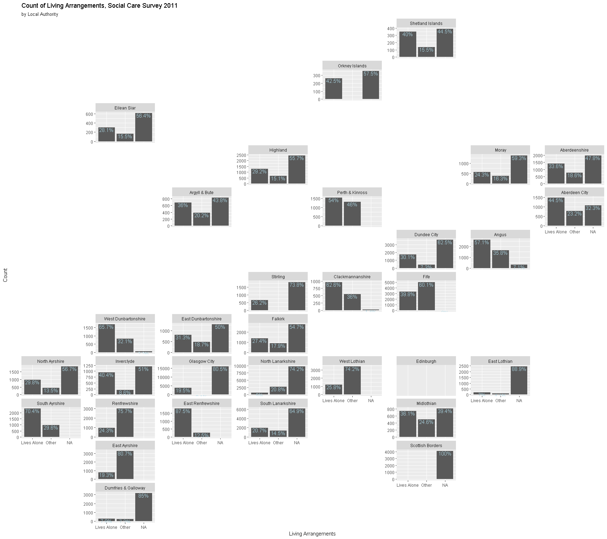
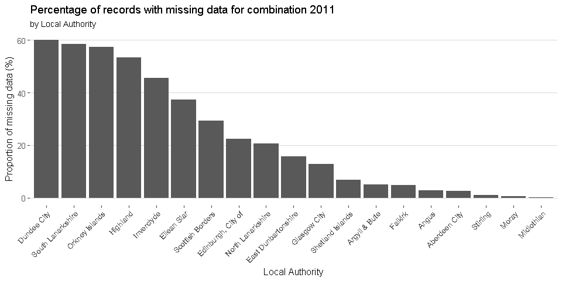

Social Care Survey Open Data
================

Introduction
============

Here I will describe missing data across the packages and impute missing data.

Load data
---------

Load in tidied data

``` r
load("produced_data/created_objects/soc_care10.rds")
load("produced_data/created_objects/soc_care11.rds")
load("produced_data/created_objects/soc_care12.rds")
load("produced_data/created_objects/skim10.rds")
load("produced_data/created_objects/skim11.rds")
load("produced_data/created_objects/skim12.rds")
```

Load Packages
-------------

``` r
library(dplyr)
library(ggplot2)
library(geofacet)
library(ggthemes)
library(mice)
library(VIM)
```

2011 Data
=========

Sticking with 2011 for now.

Describe and visualise missing data
-----------------------------------

``` r
summary(soc_care11)
```

    ##                council       client_id           age_grp     
    ##  Glasgow City      :19781   Length:142466      18-<65:23085  
    ##  North Lanarkshire :13066   Class :character   65-<75:22897  
    ##  Edinburgh, City of: 9521   Mode  :character   75-<85:49857  
    ##  South Lanarkshire : 9414                      85+   :43228  
    ##  Fife              : 8324                      NA's  : 3399  
    ##  Dundee City       : 5759                                    
    ##  (Other)           :76601                                    
    ##                     client_grp       gender          la_hrs     
    ##  Dementia & Mental Health: 8058   Male  :46281   Zero   :99411  
    ##  Learning Disability     : 5425   Female:93832   2-4    :10173  
    ##  Physical Disability     :33471   NA's  : 2353   1-2    : 6653  
    ##  Infirmity due to Age    :64587                  10-15  : 6392  
    ##  Other                   : 5020                  6-8    : 5552  
    ##  NA's                    :25905                  4-6    : 5061  
    ##                                                  (Other): 9224  
    ##     pri_hrs          vol_hrs           pc_hrs        total_hrs    
    ##  Zero   :121644   Zero   :138635   Zero   :88032   Zero   :79714  
    ##  2-4    :  4066   2-4    :   718   2-4    :11070   2-4    :12612  
    ##  10-15  :  3650   over50 :   663   10-15  : 9992   10-15  :10541  
    ##  6-8    :  3023   4-6    :   435   6-8    : 8257   6-8    : 8271  
    ##  4-6    :  2315   10-15  :   356   4-6    : 6133   1-2    : 7466  
    ##  1-2    :  1991   (Other):  1470   1-2    : 5585   4-6    : 6982  
    ##  (Other):  5777   NA's   :   189   (Other):13397   (Other):16880  
    ##  hc_client   comm_alarm  other_telecare alarm_and_tele       living_arr   
    ##  No :79714   No :49077   No :136951     No :130356     Lives Alone:38568  
    ##  Yes:62752   Yes:93389   Yes:  5515     Yes: 12110     Other      :30995  
    ##                                                        NA's       :72903  
    ##                                                                           
    ##                                                                           
    ##                                                                           
    ##                                                                           
    ##           multi_staff                housing_type    laundry     
    ##  Single Staff   :137414   Mainstream       :111834   No :139538  
    ##  2 or more Staff:  5052   Supported Housing: 22576   Yes:  2928  
    ##                           Other            :  2127               
    ##                           NA's             :  5929               
    ##                                                                  
    ##                                                                  
    ##                                                                  
    ##  shopping     housing_supp
    ##  No :137804   No :134727  
    ##  Yes:  4662   Yes:  7739  
    ##                           
    ##                           
    ##                           
    ##                           
    ## 

So this quick summary shows the variables with missing data (NA's). There are 142466 observations in the 2011 datset. I have previously removed `meals`, and `iorn_score` variables from this dataset due to quality issues.

Now, I'll use the `skimr` package to give an alternative (and tidier) way of showing the missing data.

Let's plot the missing data by variable

``` r
missing10 <-
  skim10 %>%
  dplyr::filter(stat == "missing") %>%
  dplyr::filter(value != 0) %>%
  dplyr::mutate(year = "2010") %>%
  dplyr::mutate(percentage = value / nrow(soc_care10) * 100) %>%
  dplyr::select(var, year, value, percentage)

missing11 <- 
  skim11 %>%
  filter(stat == "missing") %>%
  mutate(year = "2011") %>%
  mutate(percentage = value / nrow(soc_care11) * 100) %>%
  select(var, year, value, percentage)

missing12 <-
  skim12 %>%
  filter(stat == "missing") %>%
  mutate(year = "2012") %>%
  mutate(percentage = value / nrow(soc_care12) * 100) %>%
  select(var, year, value, percentage)

missing_data <-
  full_join(missing10, missing11) %>%
  full_join(., missing12) %>%
  arrange(var)
```

    ## Joining, by = c("var", "year", "value", "percentage")
    ## Joining, by = c("var", "year", "value", "percentage")

``` r
missing_data %>%
  filter(value != 0) %>%
  ggplot() +
  geom_col(aes(var, value)) +
  geom_text(aes(label=paste0((round(percentage, 1)),"%"), x= var,
                            y= value), size=4, vjust = -0.5, colour = "black") +
  theme(axis.text.x = element_text(angle = 45, size = 10, hjust = 1, vjust = 1)) +
  facet_wrap(~year) +
  labs(
    title = "Count and percentage of missing data by variable",
    subtitle = "Facet by Year of Social Care Survey",
    x = "Variable",
    y = "Number of records with missing data"
  ) +
  theme_hc()
```


``` r
rm(list = c("missing10", "missing11", "missing12"))
```

Only 6 varibles from each dataset appear to be missing in each year. I should be clear here that the percentage values are for the variables i.e. in 2010 36% of records have missing data for `living_arr`- these are not group(year) percentages.

I can also visualise the missingness across observations. I'll stick with 2011 again

``` r
missing_11_plot <- aggr(soc_care11, col=c('navyblue','red'), combined = TRUE, numbers=TRUE,
                    prop = FALSE, sortVars=TRUE, labels=names(soc_care11),
                    cex.axis=.7, gap=3, digits = 2, bars = FALSE,
                    ylab=c("Pattern of missing data"))
```


    ## 
    ##  Variables sorted by number of missings: 
    ##        Variable Count
    ##      living_arr 72903
    ##      client_grp 25905
    ##    housing_type  5929
    ##         age_grp  3399
    ##          gender  2353
    ##         vol_hrs   189
    ##         council     0
    ##       client_id     0
    ##          la_hrs     0
    ##         pri_hrs     0
    ##          pc_hrs     0
    ##       total_hrs     0
    ##       hc_client     0
    ##      comm_alarm     0
    ##  other_telecare     0
    ##  alarm_and_tele     0
    ##     multi_staff     0
    ##         laundry     0
    ##        shopping     0
    ##    housing_supp     0

So here we get 2 useful outputs. First of all a list of variables ordered by the amount of missingness. We also have a plot showing co-occurence of missing variables. If we look first at the bottom row, we see 64021 observations have complete data. 49072 observations are missing the `living_arr` variable only, 17175 observations are missing `living_arr` and `client_grp` variables etc. etc.

Before we can impute missing values we need to be sure that these data are missing completely at random (MCAR). To help assess this I'm going to visualise the observations with missing values.

Visualise geographical distrubution of records with missing data
----------------------------------------------------------------

One of the most obvious potential non-random causes of missing data is that one or more local authorities had worse data completion than others. To identify if this is the case I'm going to isolate all the records with missing data in the 2010 dataset then visulise these records by local authority.

``` r
library(forcats)
#Create a df of records with missing data
missing_soc_care11 <-         
  soc_care11 %>%
  filter(!complete.cases(.)) 

#Create a table counting total number records from each LA
la_missing <- 
  fct_count(soc_care11$council)

#Create a table of total numebr of records with missing data from each LA
missing_play <- 
  fct_count(missing_soc_care11$council)

#Add count of missing records to total records and calculate perecntages then plot
la_missing %<>%
  mutate(missing = as.numeric(missing_play$n)) %>%
  mutate(percentage = (missing / n) * 100) %>%
  arrange(-percentage) %>%
  mutate(f = factor(f, f))

ggplot(la_missing) +
  geom_col(aes(x = f, y = percentage)) +
  theme(axis.text.x = element_text(angle = 45, size = 10, hjust = 1, vjust = 1)) +
  theme_hc() +
  labs(
    title = "Percentage of records with missing data 2011, by Local Authority", 
    x = "Local Authority",
    y = "Proportion of missing data (%)")
```


``` r
rm(list = c("la_missing", "missing_play", "missing_soc_care11"))
```

Clearly wide variation amounts of missing data. Scottish Borders council didn't return a single record completely! I suspect this may be to do with one or two particular combinations of variables. We know from the 1st plot above approximately 49,000 variables have missing data for living arrangements only - let's check the distribution for this variable only.

Geographical distribition of missing living arrangments variable
----------------------------------------------------------------

``` r
soc_care11 %>%
  select(council, living_arr) %>%
  group_by(council, living_arr) %>%
  tally() %>%
  mutate(percentage = (n / sum(n)) * 100) %>%
  ggplot() +
  geom_col(aes(x = living_arr, y = n)) +
  geom_text(aes(label=paste0(round(percentage, 1),"%"), x= living_arr,
                            y= n), size=4, vjust = 1, colour = "light blue") +
  facet_geo(~council, grid = "scotland_local_authority_grid1", scales = "free_y") +
  labs(
    title = "Count of Living Arrangements, Social Care Survey 2011",
    subtitle = "by Local Authority",
    x = "Living Arrangements",
    y = "Count"
  )
```

    ## Some values in the specified facet_geo column 'council' do not
    ##   match the 'name' column of the specified grid and will be
    ##   removed: Edinburgh, City of



``` r
soc_care11 %>%
  select(council, living_arr) %>%
  group_by(council, living_arr) %>%
  tally() %>%
  mutate(percentage = (n / sum(n) * 100)) %>%
  filter(is.na(living_arr)) %>%
  arrange(-percentage) %>%
  ungroup(.) %>%
  mutate(council = factor(council, council)) %>%
  ggplot() +
  geom_col(aes(x = council, y = percentage)) +
  theme(axis.text.x = element_text(angle = 45, size = 10, hjust = 1, vjust = 1)) +
  theme_hc() +
  labs(
    title = "Percentage of records with missing data for Living Arrangements 2011",
    subtitle = "by Local Authority",
    x = "Local Authority",
    y = "Proportion of missing data (%)")
```

 Again, the top six local authorities with the worst levels of complete data are ranked the same when considering Living Arrangements only - does this describe all their missingness?

We know from the first missing plot that 17175 observations have missing data for a combination of `living arrangements` and `client_grp`. How does this combination compare across LA's?

Geogrphical - come up with better titles!!
------------------------------------------

``` r
soc_care11 %>%
  select(council, living_arr, client_grp) %>%
  group_by(council, living_arr, client_grp) %>% 
  tally() %>%
  group_by(council) %>%
  mutate(percentage = (n / sum(n) * 100)) %>%
  group_by(council, living_arr, client_grp) %>%
  filter(is.na(living_arr) && is.na(client_grp)) %>%
  arrange(-percentage) %>%
  ungroup(.) %>%
  mutate(council = factor(council, council)) %>%
  ggplot() +
  geom_col(aes(x = council, y = percentage)) +
  theme(axis.text.x = element_text(angle = 45, size = 10, hjust = 1, vjust = 1)) +
  theme_hc() +
  labs(
    title = "Percentage of records with missing data for combination 2011",
    subtitle = "by Local Authority",
    x = "Local Authority",
    y = "Proportion of missing data (%)")
```



Impute missing values.
----------------------

Impute values using `mice` package.

``` r
imputed_11 <- mice(soc_care11)
```

Save this imputed data

``` r
save(imputed_11, file = "produced_data/model_results/imputed_11.rds")
```

``` r
load("produced_data/model_results/imputed_11.rds")
```

Have a look

``` r
summary(imputed_11)
```

    ## Multiply imputed data set
    ## Call:
    ## mice(data = soc_care11)
    ## Number of multiple imputations:  5
    ## Missing cells per column:
    ##        council      client_id        age_grp     client_grp         gender 
    ##              0              0           3399          25905           2353 
    ##         la_hrs        pri_hrs        vol_hrs         pc_hrs      total_hrs 
    ##              0              0            189              0              0 
    ##      hc_client     comm_alarm other_telecare alarm_and_tele     living_arr 
    ##              0              0              0              0          72903 
    ##    multi_staff   housing_type        laundry       shopping   housing_supp 
    ##              0           5929              0              0              0 
    ## Imputation methods:
    ##        council      client_id        age_grp     client_grp         gender 
    ##             ""             ""      "polyreg"      "polyreg"       "logreg" 
    ##         la_hrs        pri_hrs        vol_hrs         pc_hrs      total_hrs 
    ##             ""             ""      "polyreg"             ""             "" 
    ##      hc_client     comm_alarm other_telecare alarm_and_tele     living_arr 
    ##             ""             ""             ""             ""       "logreg" 
    ##    multi_staff   housing_type        laundry       shopping   housing_supp 
    ##             ""      "polyreg"             ""             ""             "" 
    ## VisitSequence:
    ##      age_grp   client_grp       gender      vol_hrs   living_arr 
    ##            3            4            5            8           15 
    ## housing_type 
    ##           17 
    ## PredictorMatrix:
    ##                council client_id age_grp client_grp gender la_hrs pri_hrs
    ## council              0         0       0          0      0      0       0
    ## client_id            0         0       0          0      0      0       0
    ## age_grp              1         0       0          1      1      1       1
    ## client_grp           1         0       1          0      1      1       1
    ## gender               1         0       1          1      0      1       1
    ## la_hrs               0         0       0          0      0      0       0
    ## pri_hrs              0         0       0          0      0      0       0
    ## vol_hrs              1         0       1          1      1      1       1
    ## pc_hrs               0         0       0          0      0      0       0
    ## total_hrs            0         0       0          0      0      0       0
    ## hc_client            0         0       0          0      0      0       0
    ## comm_alarm           0         0       0          0      0      0       0
    ## other_telecare       0         0       0          0      0      0       0
    ## alarm_and_tele       0         0       0          0      0      0       0
    ## living_arr           1         0       1          1      1      1       1
    ## multi_staff          0         0       0          0      0      0       0
    ## housing_type         1         0       1          1      1      1       1
    ## laundry              0         0       0          0      0      0       0
    ## shopping             0         0       0          0      0      0       0
    ## housing_supp         0         0       0          0      0      0       0
    ##                vol_hrs pc_hrs total_hrs hc_client comm_alarm
    ## council              0      0         0         0          0
    ## client_id            0      0         0         0          0
    ## age_grp              1      1         1         1          1
    ## client_grp           1      1         1         1          1
    ## gender               1      1         1         1          1
    ## la_hrs               0      0         0         0          0
    ## pri_hrs              0      0         0         0          0
    ## vol_hrs              0      1         1         1          1
    ## pc_hrs               0      0         0         0          0
    ## total_hrs            0      0         0         0          0
    ## hc_client            0      0         0         0          0
    ## comm_alarm           0      0         0         0          0
    ## other_telecare       0      0         0         0          0
    ## alarm_and_tele       0      0         0         0          0
    ## living_arr           1      1         1         1          1
    ## multi_staff          0      0         0         0          0
    ## housing_type         1      1         1         1          1
    ## laundry              0      0         0         0          0
    ## shopping             0      0         0         0          0
    ## housing_supp         0      0         0         0          0
    ##                other_telecare alarm_and_tele living_arr multi_staff
    ## council                     0              0          0           0
    ## client_id                   0              0          0           0
    ## age_grp                     1              1          1           1
    ## client_grp                  1              1          1           1
    ## gender                      1              1          1           1
    ## la_hrs                      0              0          0           0
    ## pri_hrs                     0              0          0           0
    ## vol_hrs                     1              1          1           1
    ## pc_hrs                      0              0          0           0
    ## total_hrs                   0              0          0           0
    ## hc_client                   0              0          0           0
    ## comm_alarm                  0              0          0           0
    ## other_telecare              0              0          0           0
    ## alarm_and_tele              0              0          0           0
    ## living_arr                  1              1          0           1
    ## multi_staff                 0              0          0           0
    ## housing_type                1              1          1           1
    ## laundry                     0              0          0           0
    ## shopping                    0              0          0           0
    ## housing_supp                0              0          0           0
    ##                housing_type laundry shopping housing_supp
    ## council                   0       0        0            0
    ## client_id                 0       0        0            0
    ## age_grp                   1       1        1            1
    ## client_grp                1       1        1            1
    ## gender                    1       1        1            1
    ## la_hrs                    0       0        0            0
    ## pri_hrs                   0       0        0            0
    ## vol_hrs                   1       1        1            1
    ## pc_hrs                    0       0        0            0
    ## total_hrs                 0       0        0            0
    ## hc_client                 0       0        0            0
    ## comm_alarm                0       0        0            0
    ## other_telecare            0       0        0            0
    ## alarm_and_tele            0       0        0            0
    ## living_arr                1       1        1            1
    ## multi_staff               0       0        0            0
    ## housing_type              0       1        1            1
    ## laundry                   0       0        0            0
    ## shopping                  0       0        0            0
    ## housing_supp              0       0        0            0
    ## Random generator seed value:  NA

Plot

``` r
plot(imputed_11)
```


