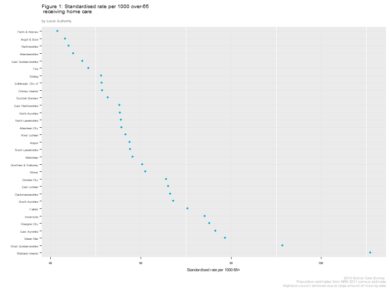

Social Care Survey Open Data
================

Introduction
============

Plot to compare number of over 65s per 1000 population receiving social care.

Based on 2012 Social Care Survey Open Data. The offical report plots per thousand population receiving home care but for the whole population - let's concentrate on over 65s.

Load data
---------

``` r
load("produced_data/created_objects/soc_care12.rds")

# This object is the cleaned version of the 2012 social care survey and was created in the file ("reports/01-import_and_tidy.html") or raw rmarkdown can be found ("rmds/import_and_tidy.Rmd")
```

Load packages
-------------

``` r
library(readr)
library(dplyr)
library(tidyr)
library(purrr)
library(forcats)
library(stringr)
library(ggplot2)
library(ggthemes)
library(extrafont)
theme_set(theme_tufte(base_size = 12))
ubdc_palette <- c("#13AFD6", "#E6E600", "#F07329", "#35B14E", "#D7509A", "#2165AF",
                  "#BCD032","#866BAC", "#545A5D",  "#7A8082", "#E2D988", "#628DB7",
                  "#929B9A", "#93B8DA", "#31649B", "#FBF8D0", "#ACB2B4", "#D1DAE2")
```

Overall numbers
===============

1st thing is to look at the overall numbers of records returned for each local autority area.

``` r
#summarise overall data first
total_summary_2012 <-
  soc_care12 %>%
  filter(age_grp != "18-<65") %>%  #drop those under 65
  group_by(council) %>%
  summarise(N_total = n()) %>%
  mutate(freq_total = N_total / sum(N_total),
         pct_total = round((freq_total * 100), 1))

#summarise homecare only data now
home_care_summary_2012 <-
  soc_care12 %>%
  filter(age_grp != "18-<65") %>%  #drop those under 65
  filter(hc_client == "Yes") %>%   #drop non-home care clients
  group_by(council) %>%
  summarise(N_homecare = n()) %>%
  mutate(freq_homecare = N_homecare / sum(N_homecare),
         pct_homecare = round((freq_homecare * 100), 1))

#and finally, summarise telecare only data
telecare_summary_2012 <-
  soc_care12 %>%
  filter(age_grp != "18-<65") %>%  #drop those under 65
  filter(hc_client == "No") %>%   #keep only non-home care clients
  group_by(council) %>%
  summarise(N_telecare = n()) %>%
  mutate(freq_telecare = N_telecare / sum(N_telecare),
         pct_telecare = round((freq_telecare * 100), 1))

#Join these table together

summary_2012_table <-
  left_join(total_summary_2012, home_care_summary_2012) %>%
  left_join(., telecare_summary_2012)
```

    ## Joining, by = "council"
    ## Joining, by = "council"

``` r
summary_2012_table
```

    ## # A tibble: 32 x 10
    ##                council N_total freq_total pct_total N_homecare
    ##                 <fctr>   <int>      <dbl>     <dbl>      <int>
    ##  1       Aberdeen City    2969 0.02558490       2.6       1784
    ##  2       Aberdeenshire    3308 0.02850618       2.9       1828
    ##  3               Angus    3643 0.03139299       3.1       1326
    ##  4       Argyll & Bute    1774 0.01528717       1.5        836
    ##  5    Clackmannanshire    1317 0.01134905       1.1        546
    ##  6 Dumfries & Galloway    3171 0.02732561       2.7       1993
    ##  7         Dundee City    4991 0.04300918       4.3       1614
    ##  8       East Ayrshire    3086 0.02659313       2.7       1632
    ##  9 East Dunbartonshire    2208 0.01902710       1.9        963
    ## 10        East Lothian    1353 0.01165927       1.2       1175
    ## # ... with 22 more rows, and 5 more variables: freq_homecare <dbl>,
    ## #   pct_homecare <dbl>, N_telecare <int>, freq_telecare <dbl>,
    ## #   pct_telecare <dbl>

``` r
rm(list = c("home_care_summary_2012", "total_summary_2012", "telecare_summary_2012"))
```

Now we can plot these

``` r
ggplot(summary_2012_table, aes(reorder(council, -N_total), N_total)) +
  geom_point(color = ubdc_palette[1], size = 3) +
  geom_text(aes(label=paste0(pct_total,"%")), size = 3, hjust = -0.3, vjust = -0.2) +
  scale_y_continuous(breaks = c(1000, 2000, 3000, 4000, 5000, 6000, 7500, 10000, 15000)) +
  theme(plot.subtitle = element_text(color = "#666666"),
        plot.caption = element_text("#AAAAAA", size = 10),
        panel.grid.major.y = element_line(colour = "#f2f2f2")) +
  labs(
    title = "Count of Social Care Clients",
    subtitle = "With percentage of total",
    x = "",
    y = "Number of Clients",
    caption = "2012 Social Care Survey") +
  coord_flip()
```


And repeat for **only** home care clients

``` r
ggplot(summary_2012_table, aes(reorder(council, -N_homecare), N_homecare)) +
  geom_point(color = ubdc_palette[3], size = 3) +
  geom_text(aes(label=paste0(pct_homecare,"%")), size=3, hjust = -0.3, vjust = -0.2) +
  scale_y_continuous(breaks = c(1000, 2000, 3000, 4000, 5000, 6000, 7500, 10000, 15000)) +
  theme(plot.subtitle = element_text(color = "#666666"),
        plot.caption = element_text("#AAAAAA", size = 10),
        panel.grid.major.y = element_line(colour = "#f2f2f2")) +
  labs(
    title = "Count of Home Care Clients",
    subtitle = "With percentage of total",
    x = "",
    y = "Number of home care clients",
    caption = "2012 Social Care Survey") +
  coord_flip()
```


And non-home care clients i.e. telecare or other services only

``` r
ggplot(summary_2012_table, aes(reorder(council, -N_telecare), N_telecare)) +
  geom_point(color = ubdc_palette[4], size = 3) +
  geom_text(aes(label=paste0(pct_telecare,"%")), size=3, hjust = -0.3, vjust = -0.2) +
  scale_y_continuous(breaks = c(1000, 2000, 3000, 4000, 5000, 6000, 7500, 10000, 15000)) +
  theme(plot.subtitle = element_text(color = "#666666"),
        plot.caption = element_text("#AAAAAA", size = 10),
        panel.grid.major.y = element_line(colour = "#f2f2f2")) +
  labs(
    title = "Count of telecare and other services clients",
    subtitle = "With percentage of total",
    x = "",
    y = "",
    caption = "2012 Social Care Survey") +
  coord_flip()
```


Population Proportions
======================

Import and tidy census data
---------------------------

To calculate proportions of over 65s getting care in each local authority we need the total number of over 65s in that LA.

For this I am going to use the 2011 Population estimates downloaded from the National Records of Scotland here:- <https://www.nrscotland.gov.uk/statistics-and-data/statistics/statistics-by-theme/population/2011-census-reconciliation-report/list-of-tables>

This data needs imported and cleaned.

I'm going to create `pop_data_combined`: a `data_frame` with population sizes of each Local Authority as a total and for over 65s

``` r
#Note I cheated and converted data to numeric in excel to remove the commas as 1000 seperators

#import and tidy raw data
pop_data <- read_csv("raw_data/2011-cen-rec-report-pop-tab1b.csv", skip = 3) %>%
  slice(1:34) %>%
  filter(X1 %in% c("Council areas", "SCOTLAND") == FALSE) %>%
  select(-X3, -X23, -X24) %>%
  map_at(2:21, as.numeric) %>% #coerce from character to numeric
  as_data_frame()

names(pop_data) <- str_replace(names(pop_data), "X1", "council") #rename X variables
names(pop_data) <- str_replace(names(pop_data), "X2", "total")

#tidy data for manipulation
pop_data_2011 <- 
  pop_data %>%
  gather(age_grp, value, 2:21) %>%  
  arrange(council)

#create table of total population per council
pop_data_total <-
  pop_data_2011 %>%
  filter(age_grp == "total") %>%  
  select(-age_grp) %>%
  arrange(council)
names(pop_data_total) <- str_replace(names(pop_data_total), "value", "pop_total")

#create table of total over65s per council
pop_data_65plus <-
  pop_data_2011 %>%
  filter(age_grp %in% c("65 - 69", "70 - 74", "75 - 79", "80 - 84", "85 - 89", 
                        "90+") == TRUE) %>%
  group_by(council) %>%
  mutate(pop_over_65 = sum(value)) %>%    
  arrange(council) %>%
  select(council, pop_over_65) %>%
  unique(.)

#join tables together
pop_data_combined_2011 <-
  full_join(pop_data_total, pop_data_65plus)  

pop_data_combined_2011
```

    ## # A tibble: 32 x 3
    ##                council pop_total pop_over_65
    ##                  <chr>     <dbl>       <dbl>
    ##  1       Aberdeen City    222793       32031
    ##  2       Aberdeenshire    252973       40663
    ##  3               Angus    115978       23061
    ##  4       Argyll & Bute     88166       19336
    ##  5    Clackmannanshire     51442        8212
    ##  6 Dumfries & Galloway    151324       33050
    ##  7         Dundee City    147268       24597
    ##  8       East Ayrshire    122767       21307
    ##  9 East Dunbartonshire    105026       20428
    ## 10        East Lothian     99717       17763
    ## # ... with 22 more rows

``` r
rm(list = c("pop_data_65plus", "pop_data_total", "pop_data"))
```

Join to social care data
------------------------

Ok, now to join together the population and social care summaries.

``` r
summary_2012_table <-
  left_join(pop_data_combined_2011, summary_2012_table)
```

    ## Joining, by = "council"

    ## Warning: Column `council` joining character vector and factor, coercing
    ## into character vector

``` r
#refactorise council
summary_2012_table$council <- as.factor(summary_2012_table$council)

#drop the total population column - we don't need it and it could get confusing

summary_2012_table <- select(summary_2012_table, -pop_total)

summary_2012_table
```

    ## # A tibble: 32 x 11
    ##                council pop_over_65 N_total freq_total pct_total N_homecare
    ##                 <fctr>       <dbl>   <int>      <dbl>     <dbl>      <int>
    ##  1       Aberdeen City       32031    2969 0.02558490       2.6       1784
    ##  2       Aberdeenshire       40663    3308 0.02850618       2.9       1828
    ##  3               Angus       23061    3643 0.03139299       3.1       1326
    ##  4       Argyll & Bute       19336    1774 0.01528717       1.5        836
    ##  5    Clackmannanshire        8212    1317 0.01134905       1.1        546
    ##  6 Dumfries & Galloway       33050    3171 0.02732561       2.7       1993
    ##  7         Dundee City       24597    4991 0.04300918       4.3       1614
    ##  8       East Ayrshire       21307    3086 0.02659313       2.7       1632
    ##  9 East Dunbartonshire       20428    2208 0.01902710       1.9        963
    ## 10        East Lothian       17763    1353 0.01165927       1.2       1175
    ## # ... with 22 more rows, and 5 more variables: freq_homecare <dbl>,
    ## #   pct_homecare <dbl>, N_telecare <int>, freq_telecare <dbl>,
    ## #   pct_telecare <dbl>

Calculate proportions per population
------------------------------------

Finally, I'm going to calculate the per thousand proportions.

``` r
per_thousand_table <-
  summary_2012_table %>%
  mutate(any_care_per_thousand = (round((N_total / pop_over_65) * 1000, 1)),  
         homecare_per_thousand = (round((N_homecare / pop_over_65) * 1000, 1)),
         telecare_per_thousand = (round((N_telecare / pop_over_65) * 1000, 1))) %>%
  select(council, any_care_per_thousand, homecare_per_thousand, telecare_per_thousand)
per_thousand_table
```

    ## # A tibble: 32 x 4
    ##                council any_care_per_thousand homecare_per_thousand
    ##                 <fctr>                 <dbl>                 <dbl>
    ##  1       Aberdeen City                  92.7                  55.7
    ##  2       Aberdeenshire                  81.4                  45.0
    ##  3               Angus                 158.0                  57.5
    ##  4       Argyll & Bute                  91.7                  43.2
    ##  5    Clackmannanshire                 160.4                  66.5
    ##  6 Dumfries & Galloway                  95.9                  60.3
    ##  7         Dundee City                 202.9                  65.6
    ##  8       East Ayrshire                 144.8                  76.6
    ##  9 East Dunbartonshire                 108.1                  47.1
    ## 10        East Lothian                  76.2                  66.1
    ## # ... with 22 more rows, and 1 more variables: telecare_per_thousand <dbl>

Save objects
------------

I'm going to save the objects created so far.

``` r
save(summary_2012_table, file = "produced_data/created_objects/summary_2012_table.rds")
save(pop_data_2011, file = "produced_data/created_objects/pop_data_2011.rds")
save(pop_data_combined_2011, file = "produced_data/created_objects/pop_data_combined_2011.rds")
save(per_thousand_table, file = "produced_data/created_objects/per_thousand_table.rds")
```

Plots
=====

Any social care
---------------

Finally! Let's take a look

``` r
ggplot(per_thousand_table, 
       aes(x = reorder(council, -any_care_per_thousand), 
           y = any_care_per_thousand)) +
  geom_point(color = ubdc_palette[5], size = 3) +
  theme(plot.subtitle = element_text(color = "#666666"),
        plot.caption = element_text("#AAAAAA", size = 10),
        panel.grid.major.y = element_line(colour = "#f2f2f2")) +
  labs(
    title = "Standardised rate per 1000 over-65 receiving\nany form of social care",
    subtitle = "by Local Authority",
    x = "",
    y = "Standardised rate per 1000 65+",
    caption = "2012 Social Care Survey, population estimates from NRS 2011 census estimate") +
  coord_flip()
```


Just to check that missing data isn't accounting for the variation....

``` r
missing <- 
  soc_care12 %>%
  group_by(council, age_grp) %>%
  tally() %>%
  filter(is.na(age_grp))
missing
```

    ## # A tibble: 12 x 3
    ## # Groups:   council [12]
    ##               council age_grp     n
    ##                <fctr>  <fctr> <int>
    ##  1      Argyll & Bute    <NA>     6
    ##  2 Edinburgh, City of    <NA>   108
    ##  3        Eilean Siar    <NA>    26
    ##  4       Glasgow City    <NA>    10
    ##  5           Highland    <NA>  1152
    ##  6         Midlothian    <NA>    12
    ##  7              Moray    <NA>     6
    ##  8    Perth & Kinross    <NA>     1
    ##  9   Scottish Borders    <NA>     1
    ## 10   Shetland Islands    <NA>     6
    ## 11           Stirling    <NA>    15
    ## 12       West Lothian    <NA>     1

So with the exception of Highland, no area has a significant amount of missing data to majorly skew results.

I'm going to remove Highland fromt the overall plot. It is likely a lot of their missing data is for over 65s.

``` r
per_thousand_table %>%
  filter(council != "Highland") %>%
  ggplot(., 
       aes(x = reorder(council, -any_care_per_thousand), 
           y = any_care_per_thousand)) +
  geom_point(color = ubdc_palette[5], size = 3) +
  theme(plot.subtitle = element_text(color = "#666666"),
        plot.caption = element_text("#AAAAAA", size = 10),
        panel.grid.major.y = element_line(colour = "#f2f2f2")) +
  labs(
    title = "Standardised rate per 1000 over-65 receiving\nany form of social care",
    subtitle = "by Local Authority",
    x = "",
    y = "Standardised rate per 1000 65+",
    caption = "2012 Social Care Survey \nPopulation estimates from NRS 2011 census estimate\nHighland council removed due to large amount of missing data") +
  coord_flip()
```


Home care only
--------------

``` r
homecare_plot<- 
  per_thousand_table %>%
  filter(council != "Highland") %>%
  ggplot(., 
       aes(x = reorder(council, -homecare_per_thousand), 
           y = homecare_per_thousand)) +
  geom_col(fill = "chartreuse4") +
  labs(
    title = "Figure 1: Number of over65s per thousand receiving home care",
    subtitle = "by Local Authority",
    x = "",
    y = "Number per thousand over 65s",
    caption = "2012 Social Care Survey, population estimates from NRS 2011 census estimate
    Highland council removed due to large amount of missing data") +
  theme_minimal(base_size=9, base_family="Roboto") +
    theme(plot.subtitle = element_text(color="#666666"),
          plot.title = element_text(family="Roboto Condensed", face = "bold"),
          plot.caption = element_text(color="#AAAAAA", size=8),
          axis.text.y = element_text(size = 8),
          axis.text.x = element_text(size = 10, face = "bold")) +
  coord_flip()
homecare_plot
```


Save this plot (for UBDC blog!)

``` r
ggsave("plots/over65s_homecare.png", homecare_plot, width=6, height=6)
```

Telecare only
-------------

``` r
per_thousand_table %>%
  filter(council != "Highland") %>%
  ggplot(., 
       aes(x = reorder(council, -telecare_per_thousand), 
           y = telecare_per_thousand)) +
  geom_col(fill = "chartreuse4") +
  theme(axis.text.y = element_text(size = 14, face = "bold")) +
  theme(axis.text.x = element_text(size = 14, face = "bold")) +
  theme_hc() +
  labs(
    title = "Number of over65s per thousand receiving telecare or other services only",
    subtitle = "by Local Authority",
    x = "",
    y = "Number per thousand over 65s",
    caption = "2012 Social Care Survey, population estimates from NRS 2011 census estimate
    Highland council removed due to large amount of missing data") +
  coord_flip()
```


Alternative UBDC blog plot
==========================

Going to try a Clevland dotplot.

``` r
homecare_plot_clevland<- 
  per_thousand_table %>%
  filter(council != "Highland") %>%
  ggplot(., 
       aes(x = reorder(council, -homecare_per_thousand), 
           y = homecare_per_thousand)) +
  geom_point(size = 1, color = ubdc_palette[1]) +
  labs(
    title = "Figure 1: Standardised rate per 1000 over-65\n receiving home care",
    subtitle = "by Local Authority",
    x = "",
    y = "Standardised rate per 1000 65+",
    caption = "2012 Social Care Survey \nPopulation estimates from NRS 2011 census estimate\nHighland council removed due to large amount of missing data") +
    theme(text = element_text(size = 6),
          axis.text.x = element_text(face = "bold"),
          panel.grid.major = element_line(colour = "#e6e6e6"),
          plot.title = element_text(hjust = 0), 
          plot.caption = element_text(colour = "#AAAAAA"),
          plot.subtitle = element_text(colour = "#666666")) +
  coord_flip()
homecare_plot_clevland
```



``` r
ggsave("plots/over65s_homecare_clevland.png", homecare_plot_clevland, width = 4, height = 3)
```
